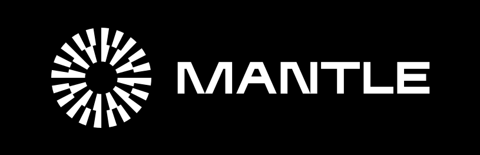

<h3><a href="https://mantle.xyz">Website</a> &nbsp&nbsp | &nbsp&nbsp&nbsp<a href="https://docs.mantle.xyz">Tech Docs</a>

 

- :book: [Introduction](#introduction)
- :question: [What's the difference?](#whats-the-difference)
- :ledger: [Directory Structure](#directory-structure)
- :sparkles: [How to Contribute](#how-to-contribute)
- :copyright: [License](#license)

## Introduction

Mantle is a suite of Ethereum scaling solutions including an optimistic rollup and ZK rollup built using an iterative modular chain approach, and supported by Mantle’s native token $MNT.

Mantle V2 is an upgrade of [Mantle V1](https://github.com/mantlenetworkio/mantle), tailored with specific adaptations to work seamlessly within the [BedRock](https://community.optimism.io/docs/developers/bedrock/explainer/) infrastructure.

 

## What's the difference?

Through its adaptations to the BedRock upgraded infrastructure, Mantle V2 has realized significant enhancements, including support for reduced gas fees, shorter deposit times, optimized node performance, and improved Ethereum compatibility, among other benefits. For more detailed information, please refer to this [documentation](https://community.optimism.io/docs/developers/bedrock/differences/).

Furthermore, due to the modular design of the Mantle Network, it supports a diverse range of components at varying layers. In comparison to OP Stack-based Rollups adapted to complete BedRock upgrades, Mantle V2 offers support for a broader spectrum of technology stacks and modules, such as:

- **MantleDA** - a simplified DA module implemented using EigenDA technology.

> We encourage you to check out the [**Mantle tech docs**](https://docs.mantle.xyz) to learn more about the inner workings of Mantle.

 

## Directory Structure

<pre>
root
├── <a href="./packages">packages</a>
│   ├── <a href="./packages/balance-monitor">balance-monitor</a>: A forta agent which detects when a specified account balance is below the specified threshold
│   ├── <a href="./packages/chain-mon">chain-mon</a>: Chain monitoring services
│   ├── <a href="./packages/common-ts">common-ts</a>: Common tools for building apps in TypeScript
│   ├── <a href="./packages/contracts">contracts</a>: L1 and L2 smart contracts for Mantle
│   ├── <a href="./packages/contracts-bedrock">contracts-bedrock</a>: BedRock upgrade contracts for Mantle
│   ├── <a href="./packages/contracts-periphery">contracts-periphery</a>: Periphery contracts for Mantle
│   ├── <a href="./packages/core-utils">core-utils</a>: Low-level utilities that make building Mantle easier
│   ├── <a href="./packages/data-transport-layer">data-transport-layer</a>: Service for indexing Mantle-related L1 data
│   ├── <a href="./packages/fault-detector">fault-detector</a>: Service for detecting Sequencer faults
│   ├── <a href="./packages/hardhat-deploy-config">hardhat-deploy-config</a>: Hardhat deploy config
│   ├── <a href="./packages/message-relayer">message-relayer</a>: Tool for automatically relaying L1<>L2 messages in development
│   ├── <a href="./packages/replica-healthcheck">replica-healthcheck</a>: Service for monitoring the health of a replica node
│   └── <a href="./packages/sdk">sdk</a>: provides a set of tools for interacting with Mantle

~~ Production ~~
├── <a href="./batch-submitter">batch-submitter</a>: Service for submitting batches of transactions and results to L1
├── <a href="./bss-core">bss-core</a>: Core batch-submitter logic and utilities
├── <a href="./gas-oracle">gas-oracle</a>: Service for updating L1 gas prices on L2
├── <a href="./integration-tests">integration-tests</a>: Various integration tests for the Mantle network
├── <a href="./l2geth">l2geth</a>: Mantle client software, a fork of <a href="https://github.com/ethereum/go-ethereum/tree/v1.9.10">geth v1.9.10</a>
├── <a href="./l2geth-exporter">l2geth-exporter</a>: A prometheus exporter to collect/serve metrics from an L2 geth node
├── <a href="./op-batcher">op-batcher</a>: L2-Batch Submitter, submits bundles of batches to L1
├── <a href="./op-bindings">op-bindings</a>: Go bindings for Bedrock smart contracts
├── <a href="./op-chain-ops">op-chain-ops</a>: State surgery utilities
├── <a href="./op-challenger">op-challenger</a>: Dispute game challenge agent
├── <a href="./op-e2e">op-e2e</a>: End-to-End testing of all bedrock components in Go
├── <a href="./op-exporter">op-exporter</a>: Prometheus exporter client
├── <a href="./op-heartbeat">op-heartbeat</a>: Heartbeat monitor service
├── <a href="./op-node">op-node</a>: rollup consensus-layer client
├── <a href="./op-program">op-program</a>: Fault proof program
├── <a href="./op-proposer">op-proposer</a>: L2-Output Submitter, submits proposals to L1
├── <a href="./op-service">op-service</a>: Common codebase utilities
├── <a href="./op-signer">op-signer</a>: Signer service client
├── <a href="./op-wheel">op-wheel</a>: Database utilities
├── <a href="./ops">ops</a>: A Docker compose project for running Mantle
├── <a href="./ops-bedrock">ops-bedrock</a>: Bedrock devnet work
├── <a href="./proxyd">proxyd</a>: Configurable RPC request router and proxy
├── <a href="./specs">specs</a>: Specs for Mantle network with BedRock upgrade
├── <a href="./technical-documents">technical-documents</a>: Audits and postmortem reports
</pre>

 

## How to Contribute

Read through [CONTRIBUTING.md](./CONTRIBUTING.md) for a general overview of our contribution process.
Then check out our list of [good first issues](https://github.com/mantlenetworkio/mantle/contribute) to find something fun to work on!

 

## License

Code forked from [`optimism`](https://github.com/ethereum-optimism/optimism) under the name [`optimism`](https://github.com/mantlenetworkio/bitnetwork/tree/master/l2geth) is licensed under the [GNU GPLv3](https://gist.github.com/kn9ts/cbe95340d29fc1aaeaa5dd5c059d2e60) in accordance with the [original license](https://github.com/ethereum-optimism/optimism/blob/master/COPYING).

All other files within this repository are licensed under the [MIT License](https://github.com/mantlenetworkio/bitnetwork/blob/master/LICENSE) unless stated otherwise.
