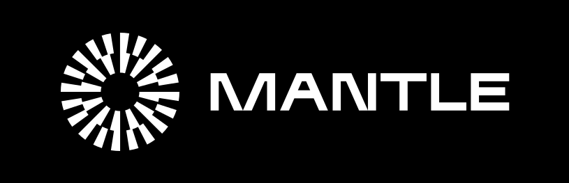

<h3><a href="https://mantle.xyz">Website</a> &nbsp&nbsp | &nbsp&nbsp&nbsp<a href="https://docs.mantle.xyz">Tech Docs</a>

- :book: [Introduction](#introduction)
- :question: [What's the difference?](#whats-the-difference)
- :ledger: [Directory Structure](#directory-structure)
- :sparkles: [How to Contribute](#how-to-contribute)
- :copyright: [License](#license)

## Introduction

Mantle is a suite of Ethereum scaling solutions including an optimistic rollup and ZK rollup built using an iterative modular chain approach, and supported by Mantle's native token $MNT.

Mantle V2 is an upgrade of [Mantle V1](https://github.com/mantlenetworkio/mantle), tailored with specific adaptations to work seamlessly within the OP Stack infrastructure. The codebase has progressed through multiple upgrade stages — BedRock, Everest, Limb — and now incorporates the latest **Arsia** upgrade, which aligns Mantle with OP Stack forks from Canyon through Jovian and introduces a new L1 data fee model.

**Fork sequence:** BaseFee → Everest → Euboea → Skadi → Limb → **Arsia**

 

## What's the difference?

Through its successive upgrades on top of the OP Stack, Mantle V2 has realized significant enhancements, including support for reduced gas fees, shorter deposit times, optimized node performance, and improved Ethereum compatibility, among other benefits. For more detailed information, please refer to this [documentation](https://docs.mantle.xyz/network/introduction/whats-new-in-mantle-v2-everest).

Furthermore, due to the modular design of the Mantle Network, it supports a diverse range of components at varying layers. In comparison to OP Stack-based Rollups, Mantle V2 offers support for a broader spectrum of technology stacks and modules, for example, Mantle Network introduces a new DA scheme, EigenDA, which can improve data management efficiency and security.

Another significant enhancement involves the adoption of `$MNT` as the native token for Mantle Network, departing from the more common choice of `$ETH` in OP Stack implementations. This adjustment aligns the design more closely with Ethereum's native architecture, leading to reduced development and maintenance costs.

> We encourage you to check out the [**Mantle tech docs**](https://docs.mantle.xyz) to learn more about the inner workings of Mantle.

 

## Directory Structure

<pre>
root
├── <a href="./packages">packages</a>
│   └── <a href="./packages/contracts-bedrock">contracts-bedrock</a>: OP Stack smart contracts for Mantle
├── <a href="./cannon">cannon</a>: Onchain MIPS instruction emulator for fault proofs
├── <a href="./devnet-sdk">devnet-sdk</a>: Comprehensive toolkit for standardized devnet interactions
├── <a href="./docs">docs</a>: A collection of documents including audits and post-mortems
├── <a href="./gas-oracle">gas-oracle</a>: Service for updating L1 gas prices on L2
├── <a href="./kona">kona</a>: Rust-based OP Stack rollup components
├── <a href="./kurtosis-devnet">kurtosis-devnet</a>: OP-Stack Kurtosis devnet
├── <a href="./op-acceptance-tests">op-acceptance-tests</a>: Acceptance tests for Mantle-specific features
├── <a href="./op-alt-da">op-alt-da</a>: Alternative Data Availability mode (beta)
├── <a href="./op-batcher">op-batcher</a>: L2-Batch Submitter, submits bundles of batches to L1
├── <a href="./op-chain-ops">op-chain-ops</a>: State surgery utilities
├── <a href="./op-challenger">op-challenger</a>: Dispute game challenge agent
├── <a href="./op-conductor">op-conductor</a>: High-availability sequencer service
├── <a href="./op-core">op-core</a>: Core protocol types and utilities
├── <a href="./op-deployer">op-deployer</a>: CLI tool for deploying and upgrading OP Stack smart contracts
├── <a href="./op-devstack">op-devstack</a>: Flexible test frontend for integration and acceptance testing
├── <a href="./op-dispute-mon">op-dispute-mon</a>: Off-chain service to monitor dispute games
├── <a href="./op-dripper">op-dripper</a>: Controlled token distribution service
├── <a href="./op-e2e">op-e2e</a>: End-to-End testing of all bedrock components in Go
├── <a href="./op-faucet">op-faucet</a>: Dev-faucet with support for multiple chains
├── <a href="./op-fetcher">op-fetcher</a>: Data fetching utilities
├── <a href="./op-interop-mon">op-interop-mon</a>: Interoperability monitoring service
├── <a href="./op-node">op-node</a>: Rollup consensus-layer client
├── <a href="./op-preimage">op-preimage</a>: Go bindings for Preimage Oracle
├── <a href="./op-program">op-program</a>: Fault proof program
├── <a href="./op-proposer">op-proposer</a>: L2-Output Submitter, submits proposals to L1
├── <a href="./op-service">op-service</a>: Common codebase utilities
├── <a href="./op-supernode">op-supernode</a>: Multi-chain node service
├── <a href="./op-supervisor">op-supervisor</a>: Service to monitor chains and determine cross-chain message safety
├── <a href="./op-sync-tester">op-sync-tester</a>: Sync testing utilities
├── <a href="./op-test-sequencer">op-test-sequencer</a>: Test sequencer for development
├── <a href="./op-up">op-up</a>: Deployment and management utilities
├── <a href="./op-validator">op-validator</a>: Tool for validating chain configurations and deployments
├── <a href="./op-wheel">op-wheel</a>: Database utilities
├── <a href="./ops">ops</a>: Various operational packages
├── <a href="./ops-bedrock">ops-bedrock</a>: Bedrock devnet work
├── <a href="./bedrock-devnet">bedrock-devnet</a>: Bedrock devnet configuration
</pre>

 

## How to Contribute

Read through [CONTRIBUTING.md](./CONTRIBUTING.md) for a general overview of our contribution process.
Then check out our list of [good first issues](https://github.com/mantlenetworkio/mantle-v2/contribute) to find something fun to work on!

 

## License

Code forked from [`go-ethereum`](https://github.com/ethereum/go-ethereum) under the name [`l2geth`](https://github.com/mantlenetworkio/mantle-v2/tree/develop/l2geth) is licensed under the [GNU GPLv3](https://gist.github.com/kn9ts/cbe95340d29fc1aaeaa5dd5c059d2e60) in accordance with the [original license](https://github.com/ethereum/go-ethereum/blob/master/COPYING).

All other files within this repository are licensed under the [MIT License](https://github.com/mantlenetworkio/mantle-v2/blob/develop/LICENSE) unless stated otherwise.
