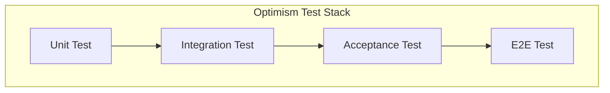

# Optimism / Mantle 测试体系（OP Stack Test Architecture）
*Version: Mantle Internal Edition*
*Status: Final*
*Purpose: Reference for Mantle Test System Design*

---

# 自动目录（Table of Contents）

- [测试体系总览](#测试体系总览)
- [Unit Tests（单元测试）](#unit-tests单元测试)
- [Integration Tests（集成测试）](#integration-tests集成测试)
- [Acceptance Tests（功能验收测试）](#acceptance-tests功能验收测试)
- [E2E Tests（系统端到端测试）](#e2e-tests系统端到端测试)
- [Mantle 专属章节](#mantle-专属章节)
  - [Mantle Arsia](#mantle-arsia)
  - [Mantle Skadi](#mantle-skadi)
  - [Mantle Fee Model](#mantle-fee-model)
  - [Mantle Derivation Changes](#mantle-derivation-changes)
- [Acceptance 与 E2E 的关系](#acceptance-与-e2e-的关系)
- [为什么 Acceptance 是 E2E 的子集](#为什么-acceptance-是-e2e-的子集)
- [E2E 是否执行正常功能](#e2e-是否执行正常功能)

---

# 测试体系总览

Optimism（OP Stack）采用四层测试体系：

```
Unit Test → Integration Test → Acceptance Test → E2E Test
```

| 测试层级 | 目标 | 范围 | 启动完整链？ | 数学模型？ | 覆盖异常？ |
|----------|------|------|--------------|------------|------------|
| Unit Test | 单模块逻辑正确性 | 合约函数、op-geth、op-node 状态机 | ❌ | ❌ | ❌ |
| Integration Test | 模块协作正确性 | op-geth＋derive＋工具链 | ❌/部分 | ❌ | ❌ |
| Acceptance Test | Fork 功能正确性 | Fjord / Isthmus / Holocene / Jovian | ✔ | ✔ | ❌ |
| E2E Test | 协议行为正确性 | 全链行为、系统恢复、边界场景 | ✔ | ❌ | ✔ |

## 测试架构图（Mermaid）



---

# Unit Tests（单元测试）

## 目标
验证最小功能单元的逻辑正确性。

## 范围
- Solidity 合约函数
- op-geth 内部函数
- op-node derive 状态机
- 编解码、fee 函数

---

## 示例代码：GasPriceOracle 单元测试

```go
func TestFjordL1Cost(t *testing.T) {
    gpo := NewGasPriceOracle()
    tx := BuildTestTx()
    got := gpo.CalculateL1Cost(tx)
    expected := CalculateFjordModel(tx)
    require.Equal(t, expected, got)
}
```

---

## 目录

```text
packages/contracts-bedrock/test/
op-geth/*_test.go
op-node/*/test
```

---

# Integration Tests（集成测试）

## 目标
验证多个模块/子系统的协作逻辑是否正确。

## 范围
- op-geth + tx builder
- op-node derive pipeline（部分）
- fault-proof VM
- op-chain-ops 工具链

---

## 示例代码：derive pipeline 集成

```go
func TestDeriveFrameToBlock(t *testing.T) {
    sys := NewDeriveTestSystem(t)
    frame := BuildFrame()
    attrs := sys.Derive(frame)
    block, err := sys.Engine.NewPayload(attrs)
    require.NoError(t, err)
    require.NotNil(t, block)
}
```

---

## 目录

```text
op-e2e/opgeth/
op-e2e/derive/
fault-proof/
op-chain-ops/check-*/
```

---

# Acceptance Tests（功能验收测试）

## 目标
验证每个 fork / feature 是否严格符合数学模型。

---

## 范围
- Fjord：FastLZ L1Cost、UpperBound
- Ecotone：blob fee / L1 cost
- Holocene：EIP‑1559 参数
- Isthmus：operator fee
- Jovian：minBaseFee / DA footprint / operator fee(×100)

---

## 示例代码：使用 FeeChecker 进行验收

```go
func TestFjordFeeAcceptance(t *testing.T) {
    sys := NewAcceptanceSystem(t)
    tx := sys.SendL2Tx(10000)
    receipt := sys.WaitReceipt(tx)

    chainFee := receipt.L1Fee
    modelFee := FeeChecker.Fjord(tx)

    require.Equal(t, modelFee, chainFee)
}
```

---

## 目录

```text
op-acceptance-tests/tests/*
```

---

# E2E Tests（系统端到端测试）

## 目标
验证完整系统在正常＋异常情况下的协议行为。

---

## 范围
- reorg → rollback → re-derive
- invalid batch
- span-batch partial invalidation
- strict ordering
- DA unavailable
- crash → restart → recover
- deposit / withdraw
- fault-proof 全流程

---

## 示例代码：reorg 测试

```go
func TestReorgRecovery(t *testing.T) {
    sys := NewSystem(t)

    l2tx := sys.ActL2Tx("alice", 1e9)
    sys.WaitL2(l2tx)

    sys.ReorgL1(2)
    sys.Derive()

    // 确认 rollback 后状态正确
    sys.AssertStateConsistent()
}
```

---

## 目录

```text
op-e2e/system/*
op-e2e/actions/*
op-e2e/faultproofs/*
```

---

# Mantle 专属章节

## Mantle Arsia
- 已合并 OP Fjord / Holocene / Isthmus / Jovian 所有功能
- Fjord L1Cost 采用 OP 原版
- Mantle 自身的 BaseFee fork 被禁用
- Fee Model 全面对齐 OP Arsia

---

## Mantle Skadi
- 提前启用了 EIP‑7702
- block gossip topic 从 V1 → V4
- engine_newPayload 升级至 V4（与 OP 一致）

---

## Mantle Fee Model
Mantle Arsia 激活后：

- Fjord L1Cost 生效
- Isthmus operator fee 按 Jovian 逻辑计算
- Jovian minBaseFee
- Jovian DA footprint

---

## Mantle Derivation Changes
Mantle 完整继承 OP Holocene 规则：

- strict batch ordering
- partial span-batch invalidation
- fast channel invalidation
- steady block derivation

---

# Acceptance 与 E2E 的关系

## ✔ Acceptance 是 E2E 的“行为子集”
- 两者使用相同链环境
- Acceptance 仅验证正常路径
- E2E 覆盖正常＋异常＋边界

---

# 为什么 Acceptance 是 E2E 的子集

```
E2E 行为空间 = 正常 + 异常 + 边界
Acceptance 行为空间 = 正常
=> Acceptance ⊂ E2E
```

---

# E2E 是否执行正常功能

会执行，但目标不同：

| 功能 | Acceptance | E2E |
|------|------------|------|
| 验证 Fjord L1Cost | ✔ 精确比对数学模型 | ❌ 不检查公式 |
| Fjord 在 reorg 下行为 | ❌ | ✔ |
| Fjord + invalid batch | ❌ | ✔ |
