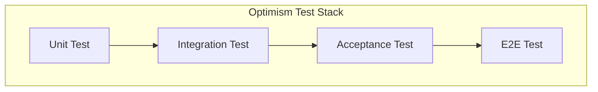

# Optimism / Mantle 测试体系（OP Stack Test Architecture）
*Version: Mantle Internal Edition* \
*Status: Final* \
*Purpose: Reference for Mantle Test System Design*

---

# 自动目录（Table of Contents）

- [测试体系总览](#测试体系总览)
- [Unit Tests（单元测试）](#unit-tests单元测试)
- [Integration Tests（集成测试）](#integration-tests集成测试)
- [Acceptance Tests（功能验收测试）](#acceptance-tests功能验收测试)
- [E2E Tests（系统端到端测试）](#e2e-tests系统端到端测试)
- [op-acceptance-tests 结构与作用](#op-acceptance-tests-结构与作用)
- [op-e2e 结构与作用](#op-e2e-结构与作用)
- [Mantle升级改动指南](#mantle-fusaka-升级改动指南)
- [Mantle 专属章节](#mantle-专属章节)
  - [Mantle Arsia](#mantle-arsia)
  - [Mantle Skadi](#mantle-skadi)
  - [Mantle Fee Model](#mantle-fee-model)
  - [Mantle Derivation Changes](#mantle-derivation-changes)
- [Acceptance 与 E2E 的关系](#acceptance-与-e2e-的关系)
- [为什么 Acceptance 是 E2E 的子集](#为什么-acceptance-是-e2e-的子集)
- [E2E 是否执行正常功能](#e2e-是否执行正常功能)

---

# 测试体系总览

Optimism（OP Stack）采用四层测试体系：

```
Unit Test → Integration Test → Acceptance Test → E2E Test
```

| 测试层级 | 目标 | 范围 | 启动完整链？ | 数学模型？ | 覆盖异常？ |
|----------|------|------|--------------|------------|------------|
| Unit Test | 单模块逻辑正确性 | 合约函数、op-geth、op-node 状态机 | ❌ | ❌ | ❌ |
| Integration Test | 模块协作正确性 | op-geth＋derive＋工具链 | ❌/部分 | ❌ | ❌ |
| Acceptance Test | Fork 功能正确性 | Fjord / Isthmus / Holocene / Jovian | ✔ | ✔ | ❌ |
| E2E Test | 协议行为正确性 | 全链行为、系统恢复、边界场景 | ✔ | ❌ | ✔ |

## 测试架构图（Mermaid）



---

# Unit Tests（单元测试）

## 目标
验证最小功能单元的逻辑正确性。

## 范围
- Solidity 合约函数
- op-geth 内部函数
- op-node derive 状态机
- 编解码、fee 函数

---

## 示例代码：GasPriceOracle 单元测试

```go
func TestFjordL1Cost(t *testing.T) {
    gpo := NewGasPriceOracle()
    tx := BuildTestTx()
    got := gpo.CalculateL1Cost(tx)
    expected := CalculateFjordModel(tx)
    require.Equal(t, expected, got)
}
```

---

## 目录

```text
packages/contracts-bedrock/test/
op-geth/*_test.go
op-node/*/test
```

---

# Integration Tests（集成测试）

## 目标
验证多个模块/子系统的协作逻辑是否正确。

## 范围
- op-geth + tx builder
- op-node derive pipeline（部分）
- fault-proof VM
- op-chain-ops 工具链

---

## 示例代码：derive pipeline 集成

```go
func TestDeriveFrameToBlock(t *testing.T) {
    sys := NewDeriveTestSystem(t)
    frame := BuildFrame()
    attrs := sys.Derive(frame)
    block, err := sys.Engine.NewPayload(attrs)
    require.NoError(t, err)
    require.NotNil(t, block)
}
```

---

## 目录

```text
op-e2e/opgeth/
op-e2e/derive/
fault-proof/
op-chain-ops/check-*/
```

---

# Acceptance Tests（功能验收测试）

## 目标
验证每个 fork / feature 是否严格符合数学模型。

---

## 范围
- Fjord：FastLZ L1Cost、UpperBound
- Ecotone：blob fee / L1 cost
- Holocene：EIP‑1559 参数
- Isthmus：operator fee
- Jovian：minBaseFee / DA footprint / operator fee(×100)

---

## 示例代码：使用 FeeChecker 进行验收

```go
func TestFjordFeeAcceptance(t *testing.T) {
    sys := NewAcceptanceSystem(t)
    tx := sys.SendL2Tx(10000)
    receipt := sys.WaitReceipt(tx)

    chainFee := receipt.L1Fee
    modelFee := FeeChecker.Fjord(tx)

    require.Equal(t, modelFee, chainFee)
}
```

---

## 目录

```text
op-acceptance-tests/tests/*
```

---

# E2E Tests（系统端到端测试）

## 目标
验证完整系统在正常＋异常情况下的协议行为。

---

## 范围
- reorg → rollback → re-derive
- invalid batch
- span-batch partial invalidation
- strict ordering
- DA unavailable
- crash → restart → recover
- deposit / withdraw
- fault-proof 全流程

---

## 示例代码：reorg 测试

```go
func TestReorgRecovery(t *testing.T) {
    sys := NewSystem(t)

    l2tx := sys.ActL2Tx("alice", 1e9)
    sys.WaitL2(l2tx)

    sys.ReorgL1(2)
    sys.Derive()

    // 确认 rollback 后状态正确
    sys.AssertStateConsistent()
}
```

---

## 目录

```text
op-e2e/system/*
op-e2e/actions/*
op-e2e/faultproofs/*
```

---

# op-acceptance-tests 结构与作用

## 目录速览
```text
op-acceptance-tests/
├─ acceptance-tests.yaml        # gate 定义与测试注册
├─ cmd/                         # 运行包装器：选择 orchestrator/devnet/gate
├─ scripts/                     # devnet / 运行辅助脚本
└─ tests/                       # Go 测试源：base/interop/isthmus/jovian 等
```

## 核心组件
- `acceptance-tests.yaml`：声明 gate（base/interop/isthmus/flashblocks/...），每个 gate 注册对应的测试 package 与超时时间；`inherits` 链接 gate（如 base 继承 isthmus）。
- `cmd/main.go`：cli 封装，选择 orchestrator（`sysgo` 内存链，`sysext` Kurtosis/外部链）、devnet 名称、gate、`--reuse-devnet` 等；解析 `--validators` 路径并调用 `op-acceptor`。
- `cmd/flake-shake-*`：与 flake-shake 稳定性验证相关的工具。
- `scripts/`：对 Kurtosis devnet 的部署、日志、清理等封装。
- `tests/`：按 fork/功能分包，如 `tests/base`、`tests/interop`、`tests/isthmus`、`tests/fjord`、`tests/jovian` 等，均为普通 Go 测试。

## 子模块说明
- `cmd/`：运行入口与 flake-shake 辅助命令，统一 orchestrator/devnet/gate 选项，自动调用 `op-acceptor`。
- `scripts/`：Kurtosis/devnet 生命周期管理、日志抓取、资源清理等脚本。
- `tests/base`：通用基础冒烟（存取款、链存活等）。
- `tests/interop`：多 L2 消息、同步、合约互通等互操作场景。
- `tests/isthmus`：Isthmus 相关逻辑（operator fee、withdrawal root、bridge）。
- `tests/fjord` / `tests/ecotone` / `tests/jovian`：各 fork 专属功能与费模型验收。
- `tests/flashblocks`：flashblocks 网络特性。
- `tests/sync` / `tests/sync_tester`：同步行为与 op-sync-tester 相关用例。
- `tests/supernode` / `tests/safeheaddb_*`：supernode 与 safe head DB 行为的验收。
- `tests/fusaka`：预留 Mantle Fusaka 相关验证（按需扩充）。

## 常见名词解释
- `flake-shake`：新/疑似不稳定测试的隔离 gate，重复运行判定稳定性（搭配 `cmd/flake-shake-*` 聚合/晋级工具）。
- `sysgo` / `sysext`：in-process 内存链 orchestrator 与外部/Kurtosis orchestrator 选择。
- `gate`：测试集合与晋级门槛的抽象，`acceptance-tests.yaml` 中定义，支持继承（父 gate 先跑）。

## Gate 列表与作用（`acceptance-tests.yaml`）
- `flake-shake`：隔离/稳态验证 gate，新测或疑似不稳定用例多次运行以确认稳定性。
- `isthmus`：Isthmus 升级功能验收（operator fee、withdrawal root、ERC20 bridge 等），是后续 gate 的基础。
- `base`（继承 isthmus）：通用冒烟/健全性 gate，覆盖基础存取款、链存活、Fjord/Ecotone 等核心功能。
- `conductor`：包含 conductor 组件的网络健全性检查。
- `pre-interop`（继承 base）：互操作前的 readiness 检查（如 TestInteropReadiness）。
- `interop`（继承 base）：多 L2 互操作场景（消息、同步、合约互通、smoke）。
- `interop-loadtest`：互操作负载/压力 gate。
- `flashblocks`（继承 base）：flashblocks 网络特性验证。
- `flashblocks-with-isthmus`（继承 base）：flashblocks 特性 + Isthmus 组合验证。
- `sync-test-op-node`：使用 op-sync-tester 的外部网络同步测试（定时运行）。
- `jovian`（继承 base）：Jovian 升级特性验收（minBaseFee、DA footprint 等）。

## 运行方式
- 快速本地（in-process，`sysgo`）：`just acceptance-test "" base` 或 `go run cmd/main.go --orchestrator sysgo --gate base --testdir .. --validators ./acceptance-tests.yaml`.
- 外部/Kurtosis（`sysext`）：`just acceptance-test simple base` 或指定 `--devnet interop --gate interop --kurtosis-dir ../kurtosis-devnet`.
- flake-shake：`op-acceptor --gate flake-shake --flake-shake --flake-shake-iterations N ...`。

## 作用
- 作为网络晋级 gate，验证“正常路径”是否符合协议数学模型与功能要求。
- 提供可复用的 devnet 启停、测试注册与分 gate 控制，以便按 fork 推进。

---

# op-e2e 结构与作用

## 目录速览
```text
op-e2e/
├─ Makefile               # test-actions / test-ws / test-cannon 等入口
├─ e2e.go                 # 并行开关、公共测试 Helper
├─ actions/               # DSL 式动作测试（无并发、mock clock）
├─ system/                # 系统级测试（含 L1/L2/服务全链；已标记 deprecated）
├─ faultproofs/           # 整合 fault-proof 堆栈测试
├─ interop/               # 多 L2 super-system 系统测试
├─ opgeth/                # 与 op-geth 执行层的集成/升级测试
├─ e2eutils/              # 复用的链/交易/节点 helper
├─ scripts/               # 绑定生成、工具脚本
└─ bindings*/             # 合约绑定输出目录
```

## 核心组件
- `Makefile`：`test-actions` 跑 `./actions/...`，`test-ws` 跑 `./system/... ./e2eutils/... ./opgeth/... ./interop/...`；`test-cannon`/`test-fault-proofs` 对应 faultproofs；`OP_E2E_DISABLE_PARALLEL` 等环境变量控制并行。
- `actions/`：按领域拆分（derivation/batcher/proposer/sync/interop/proofs/altda 等），同步执行、无后台进程，聚焦状态转换与边界场景。
- `system/`：全链组件（L1 miner、L2 sequencer/verifier/batcher/proposer）+ 实时钟，覆盖恢复、重组、P2P 等；虽已标记 deprecated，但仍有存量测试（bridge/da/fjord/isthmus/p2p/...）。
- `faultproofs/`：包含 Cannon/FP 堆栈的系统级测试。
- `interop/`：多 L2 互操作 super-system 的系统测试。
- `e2eutils/`：链启动、交易构建、批次、挑战、blobstore 等通用 helper，供 actions/system 共享。

## 子模块说明
- `config/`：测试配置与默认密钥初始化。
- `actions/derivation`：derive 管道、batch/frame 处理的细粒度状态验证。
- `actions/batcher` / `actions/proposer` / `actions/sequencer`：对应服务的状态转换、费用、批次生成等测试。
- `actions/interop`：多 L2 互操作的动作级（无并发）验证。
- `actions/proofs` / `actions/altda` / `actions/sync` / `actions/safedb`：证明、DA、同步、safe DB 等专项。
- `system/bridge` / `system/da` / `system/p2p` / `system/fjord` / `system/isthmus` / `system/altda` / `system/conductor` / `system/verifier`：全链+实时钟场景，覆盖跨链、数据可用性、P2P、fork 行为及恢复。
- `system/helpers` / `system/runcfg`：系统测试通用辅助与运行配置。
- `faultproofs/`：带 fault-proof 堆栈的系统测试（含 Cannon）。
- `opgeth/`：与 op-geth 的集成、升级和回归验证。
- `interop/`：多 L2 super-system 的系统级端到端用例。
- `e2eutils/`：公用工具库（opnode 启动、交易构造、blobstore/challenger/fakebeacon/intentbuilder 等），被 actions/system/faultproofs 复用。
- `scripts/`：生成合约绑定、辅助运行脚本。

## 常见名词解释
- `faultproofs`：带 fault-proof 组件（Cannon/FP VM、挑战游戏等）的系统级测试套件。
- `actions`：无并发、按步骤推进的 DSL 式测试，聚焦状态转换/边界条件。
- `system`：全链+实时钟的端到端测试（存量维护，新增用例建议写在 acceptance）。
- `interop`：多 L2 互操作 super-system 测试（包含 actions 与 system 版本）。
- `opgeth`：与 op-geth 执行层的集成/回归测试。
- `e2eutils`：测试公共库，封装链启动、交易构造、批次、挑战、blobstore 等。
- `cannon-prestates` / `OP_E2E_CANNON_ENABLED`：运行 faultproofs/Cannon 相关测试所需的预状态与开关。

## 作用
- 较 Acceptance 更宽的行为覆盖，包含异常/恢复路径与跨组件交互。
- 仍保留部分系统测试以防回归，动作测试用于细粒度状态验证。

---

# Mantle Fusaka 升级改动指南

> 目标：让 Mantle 在 Fusaka fork 前后，Acceptance 与 E2E 都能验证新规则。

## op-acceptance-tests
- **Gate 注册**：在 `op-acceptance-tests/acceptance-tests.yaml` 新增 `fusaka` gate（通常继承 `base` 或前一 fork），为 Fusaka 专属测试设置 `package` 与 `timeout`。已有 `tests/fusaka` 目录时，将包路径注册进去；如无则创建该目录并添加测试。
- **测试实现**：在 `tests/fusaka/*` 编写针对 Fusaka 规则的正向验证（fee 模型、参数开关、协议限制等），遵循现有 base/interop 模式。
- **Devnet 支持**：使用 `sysext` 时，确保 `kurtosis-devnet` 或外部网络具备 Fusaka 链配置（genesis、rollup config、op-geth/op-node 版本）。必要时在 `scripts/` 或 Kurtosis 模板中新增 Fusaka preset。
- **运行验证**：本地快速验证用 `sysgo`：`just acceptance-test "" fusaka`。外部链验证：`just acceptance-test <devnet> fusaka --reuse-devnet` 或 `go run cmd/main.go --orchestrator sysext --devnet <name> --gate fusaka --validators ./acceptance-tests.yaml --kurtosis-dir ../kurtosis-devnet`.

## op-e2e
- **动作测试**：为 Fusaka 规则添加/更新对应的 `actions/*`（如 derivation/fees/interop），重用 `e2eutils`；若需要新参数（如链配置、升级高度），在相关 helper 中增加可配置项。
- **系统测试（如仍需要）**：在 `system/` 下创建 Fusaka 专属子目录或扩充现有测试，涵盖恢复、跨链、P2P 等；更新创世/rollup 配置以开启 Fusaka 标志。
- **构建与运行**：使用 `make test-actions` 先验证动作测试；如保留系统覆盖，使用 `make test-ws`（若涉及 fault-proofs，则 `make test-fault-proofs`/`test-cannon`）。必要时设置 `OP_E2E_DISABLE_PARALLEL`、`OP_E2E_CANNON_ENABLED`。
- **依赖与路径**：确保 `op-program/bin`、`cannon-prestates`、合约绑定等前置可用；如 Mantle 模块路径与上游不同，更新 import/module path 后 `go mod tidy`。

## 迁移小贴士
- 保持目录相对位置不变（`op-acceptance-tests`、`op-e2e`、`kurtosis-devnet`、`op-program` 等）以兼容脚本/Makefile。
- 新增 fork 时可先在 Acceptance 写“正常路径”测试，E2E 补充异常/恢复场景，避免重复覆盖。

---

# Mantle 专属章节

## Mantle Arsia
- 已合并 OP Fjord / Holocene / Isthmus / Jovian 所有功能
- Fjord L1Cost 采用 OP 原版
- Mantle 自身的 BaseFee fork 被禁用
- Fee Model 全面对齐 OP Arsia

---

## Mantle Skadi
- 提前启用了 EIP‑7702
- block gossip topic 从 V1 → V4
- engine_newPayload 升级至 V4（与 OP 一致）

---

## Mantle Fee Model
Mantle Arsia 激活后：

- Fjord L1Cost 生效
- Isthmus operator fee 按 Jovian 逻辑计算
- Jovian minBaseFee
- Jovian DA footprint

---

## Mantle Derivation Changes
Mantle 完整继承 OP Holocene 规则：

- strict batch ordering
- partial span-batch invalidation
- fast channel invalidation
- steady block derivation

---

# Acceptance 与 E2E 的关系

## ✔ Acceptance 是 E2E 的“行为子集”
- 两者使用相同链环境
- Acceptance 仅验证正常路径
- E2E 覆盖正常＋异常＋边界

---

# 为什么 Acceptance 是 E2E 的子集

```
E2E 行为空间 = 正常 + 异常 + 边界
Acceptance 行为空间 = 正常
=> Acceptance ⊂ E2E
```

---

# E2E 是否执行正常功能

会执行，但目标不同：

| 功能 | Acceptance | E2E |
|------|------------|------|
| 验证 Fjord L1Cost | ✔ 精确比对数学模型 | ❌ 不检查公式 |
| Fjord 在 reorg 下行为 | ❌ | ✔ |
| Fjord + invalid batch | ❌ | ✔ |
