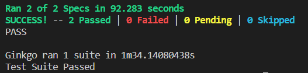

# Overview

This document contains getting started procedures for building, testing, and developing EigenDA locally. 

- See [Setting up a development environment](#setting-up-a-development-environment) for instructions for setting up a development environment. 
- See [Building from source](#building-from-source) for options to build the EigenDA components locally or using Docker. 
- See [Deploy EigenDA locally](#deploy-eigenda-locally) for instructions to deploy EigenDA within a local testing environment and run a suite of integration tests.

# Directory Structure
<pre>
├── <a href="./cluster">cluster</a>: Tools for deploying an EigenDA testnet with k8
┌── <a href="./common">common</a>
|   ├── <a href="./common/contracts">contracts</a>: Integrations between parties involved in EigenDA and the chain
|   ├── <a href="./common/crypto">crypto</a>: BLS signature and KZG commitment utilities for EigenDA
|   ├── <a href="./common/graphView">graphView</a>: Utilities for retrieving indexed information from the EigenDA subgraph
|   ├── <a href="./common/interfaces">interfaces</a>: GRPC interfaces for the servers run by parties involved in EigenDA
|   ├── <a href="./common/logging">logging</a>: Logging utilities for pretty EigenDA logs
|   └── <a href="./common/storage">storage</a>: Simple [LevelDB](https://github.com/syndtr/goleveldb) wrapper for easy
├── <a href="./contracts">contracts</a>
|   ├── <a href="./contracts/eignlayer-contracts">eigenlayer-contracts</a>: Contracts for the EigenLayer restaking platform and the EigenDA middlware
|   └── <a href="./contracts/rollup-example-contracts">rollup-example-contracts</a>: Contracts for an example rollup using EigenDA
├── <a href="./dl-disperser">dl-disperser</a>: Core EigenDA dispersal service
├── <a href="./dl-node">dl-node</a>: Core EigenDA operator node
├── <a href="./dl-retriever">dl-retriever</a>: Core EigenDA retriever service
├── <a href="./integration">integration</a>: Tools for running integration tests
├── <a href="./lib">lib</a>
|   ├── <a href="./lib/encoding">encoding</a>: Core polynomial commitment encoding/decoding functionality
|   └── <a href="./lib/merkzg">merkzg</a>: A merkle tree implementation of powers of tau used for efficient access on chain 
├── <a href="./middleware">middleware</a>: Example off-chain code for a rollup using EigenDA
└── <a href="./subgraph">subgraph</a>: Subgraph run by all parties involved in EigenDA to index the EigenDA contracts
</pre>


# Setting up a development environment

Clone the datalayr repo using the `--recursive` option in order to clone all submodules

Via HTTPS:
```
git clone --recursive https://github.com/Layr-Labs/datalayr.git
```
Via SSH:
```
git clone --recursive git@github.com:Layr-Labs/datalayr.git
```

We present two options for setting up a local development environment: 1) developing using a devcontainer, 2) developing locally. We recommend only trying to set up a local development environment after working through the sections of this README in the devcontainer environment in order to get a feel for the expected behavior. We also recommend using a linux environment for local development if possible, since this environment is the most well-tested. 

## Devcontainer

We highly recommend using devcontainers in order to set up a local development environment. This allows developers to work within a containerized environment which has all required dependencies preinstalled. 

To get started with Dev Containers using VS Code:
1. Install Docker+Docker Compose (https://docs.docker.com/engine/install/ubuntu/).
2. Install the [Dev Containers](https://marketplace.visualstudio.com/items?itemName=ms-vscode-remote.remote-containers) extension for VS code.
3. Use VS code to open the directory containing the cloned repository. 
4. Use the VS command pallette to run the "Dev Containers: Open Folder in Container" command. 

This will create a devcontainer with all required dependencies installed, and then connect VS code to this container. For more information about devcontainers, see the [Getting Started](https://code.visualstudio.com/docs/devcontainers/tutorial) page. 

## Local Development

### Requirements for building from source

The following dependencies are required for building EigenDA locally.
- Go (>=1.18): See https://go.dev/doc/install for installation instructions on your platform. 
- Foundry: See https://github.com/foundry-rs/foundry for installation instructions. 
- Geth: See https://geth.ethereum.org/docs/install-and-build/installing-geth for installation instructions.
- jq: See https://stedolan.github.io/jq/download/ for installation instructions.
- md5sum: Follow the instructions for your platform.

### Requirements for running a running local integration tests

The following dependencies are required for setting up a local testing environment, in addition to those required for building:

- Docker and Docker compose: See https://docs.docker.com/engine/install/ubuntu/ for installation instructions.
- Node/Yarn: We recommend using [NVM](https://github.com/nvm-sh/nvm) to install a recent version of Node and Yarn. 
- Ginkgo: Run `go install github.com/onsi/ginkgo/v2/ginkgo@v2.2.0`
- yq: Run `go install github.com/mikefarah/yq/v4@latest`
- grpcurl: Run `go install github.com/fullstorydev/grpcurl/cmd/grpcurl@latest`

(If installing tools with go, ensure that the go path is added to your path, e.g. by adding `export PATH="${PATH}:$(go env GOPATH)/bin"` to your `~/.bashrc` file in linux.) 

### Setting up the local development environment

After the above dependencies are installed, run the following bash script in order to set up the local testing environment (If you are using a devcontainer, this script will already have run upon the creation of the devcontainer.)

```
./setup.sh
```

This will 1) create a `.env` files within the `./integration` folders which is used for keeping track of local experiment information, 2) pull files containing the KZG Structred Random String (SRS) from an AWS bucket, and 3) initialize a local geth chain for use in local experiments. 


# Building from source

## Building locally

The following command builds the binaries for all EigenDA components and middleware example components. 

```
make binaries
```

## Building with docker
If you have [Docker](https://docs.docker.com/get-docker/) installed with Docker Compose, you can build the Docker images by running
```
make images
```

# Deploy EigenDA locally

## Deployment procedure

The directory `./integration/scripts/deploy` contains a script for deploying the EigenLayer and DataLayr contracts and setting up a set of EigenDA components to run locally. The deployment script consumes a configuration file described briefly in the next section. 

Typically, for each new local deployment, we create a new experiment folder within the `./integration/data` folder which contains the configuration file for that deployment. When deploying a new local experiment, we point the deployment script to this experiment folder. The deploy script will read the config file and populate the experiment folder various items including:
- Deployment logs for the EigenLayer and EigenDA contracts
- Generated configurations for the EigenDA components
- Log files output by the EigenDA components
- File databases (e.g. leveldb) used by the EigenDA components
- Docker compose files used to easily launch the EigenDA docker images

If a deployment or integration test fails unexpectedly, it can be useful to visit the logs contained in this experiment folder to determine the source of failure. 

## Configuring a local EigenDA deployment

We utilize a primitive yaml configuration file for configuring local deployments of the EigenDA network. Configuration templates can be viewed in `./integration/config.*.yaml`. Many aspects of these files, such as the number of components to deploy, can be easily modified in order to change properties of the deployed experiment. However, the existing templates are sufficient for running all end-to-end tests. 

[TODO: Further infromation about config.yaml format]

## Running an End to End Integration Test

To run an end-to-end integration test of basic EigenDA functionality, run the following command:

```
make test-new-infra
```

This will perform the following actions:
1. Initialize a new experiment by creating a new experiment folder within `./integration/data` containing a `config.yaml` file generated from the `./integration/config.full.yaml` template. 
2. Use the configuration to deploy the experiment, which includes the following actions. Logs for each of the deployment actions can be found within `./integrations/data/[EXPERIMENT]/deploy.log`.
    - Deploy the EigenLayer and EigenDA contracts using the configured deployer.
    - Provision the stakers, operators, dispersers, sequencers, and challengers with tokens for staking and making transactions. 
    - Deploy the Rollup Example Contract using the configured deployer.
    - Generate a set of environment files containing the configuration information needed to start each EigenDA component. 
    - Launch the EigenDA components, and wait for them to reach a ready state (i.e., for them to open their respective server ports).
3. Run basic integration tests from `./integration/integration_test.go`:
    - Dispersal and Retrieval: This test will disperse a blob to the EigenDA operators, retrieve the blob, and check that the recovered blob matches the original blob.
    - Posting blocks to rollup: This test will send a sequence of both valid and invalid blocks to the rollup sequencer. After the first invalid block is posted to the rollup, the sequencer's attempt to post further blocks will fail due to slashing by the rollup challenger. 

At the end of a successful integration test, you should see the following output: 



## Useful commands

The above command will recreate infrastructure such as the geth chain each time it is run. The following commands can be used to control deployments in a more fine-grained manner. 

- `make deploy-chain`: Use docker compose to start testing infrastructure such as geth node and graph node.
- `make destroy-chain`: Halt testing infrastructure. 
- `make deploy-chain-n-explorer`: Launch testing infrastructure along with a Block Scout block explorer which can be used to inspect transactions made as part of the operation of EigenDA.
- `make destroy-chain-n-explorer`: Halt testing infrastructure, including block explorer.
- `make deploy-experiment`: Initialize a new experiment using the `./integration/config.full.yaml` template and deploy the experiment.
- `make test-new-contract`: Deploy a new experiment, start components, and run integration tests.
- `make test-new-nodes`: Start the EigenDA components of an existing experiment and run integration tests
- `make deploy-nodes`: Start the EigenDA components, such as the operator nodes, dispersers, etc. associated with an experiment which has already been deployed (Can be run after `make test-new-infra`, `make test-new-contract`, or `make deploy-experiment`)
- `make destroy-nodes`: Stop the components associated with a given experiment.

