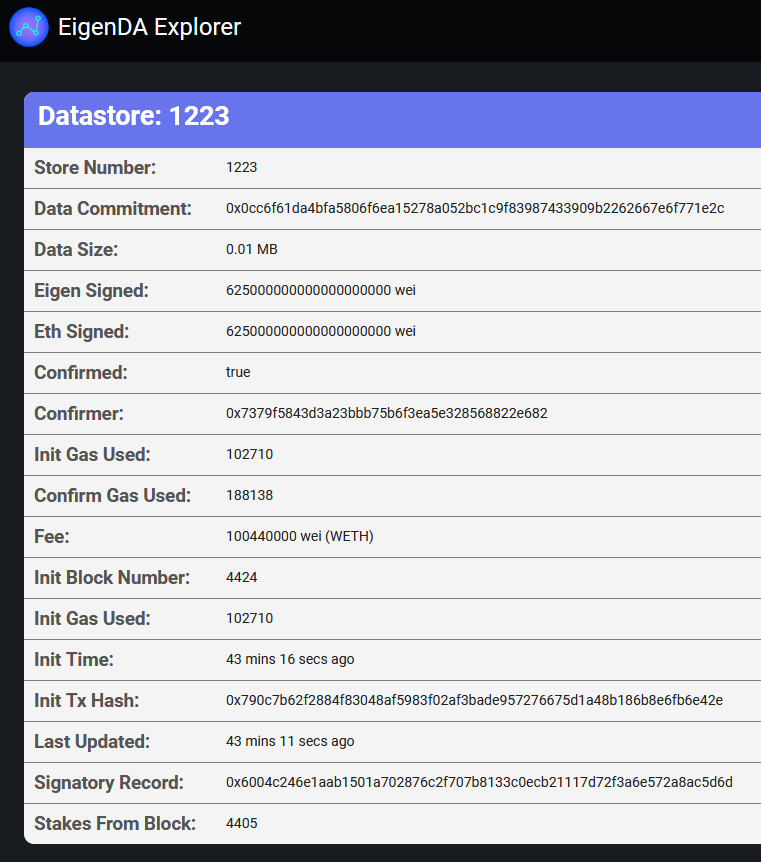

# Dispersing and retrieving to and from devnet


APIs exposed by the Devnet disperser and retriever [components](https://docs.eigenda.xyz/how-it-works/protocol/components/) can be used to disperse and retrieve data to and from the EigenDA deployment running on the devnet. We will show an example of posting the EigenDA README.md file to EigenDA. 

### Prerequisites
In order to run the commands shown below, you will need to install the following tools: 
1. [grpcurl](https://github.com/fullstorydev/grpcurl). If you have go installed, grpcurl can be installed using the `go install github.com/fullstorydev/grpcurl/cmd/grpcurl@latest`.
2. [yq](https://github.com/mikefarah/yq). If you have go installed, yq can be installed using `go install github.com/mikefarah/yq/v4@latest`.

(If installing these tools with go, ensure that the go path is added to your path, e.g. by adding `export PATH="${PATH}:$(go env GOPATH)/bin"` to your `~/.bashrc` file in linux.) 

### Posting to EigenDA

To post the contents of the README file to EigenDA, we can utilize the `EncodeAndDisperseStore` grpc method implemented by the disperser. The protobuf file defining this interface is found in `common/interfaces/interfaceDL/disperse.proto`. The following command use grpcurl to call the `EncodeAndDisperseStore` method with the `Data` field as the (base64-encoded) contents of `README.md` and the `Duration` field set to one unit (The length of a unit is defined by the EigenDA smart contracts, and defaults to 1 hour). 

The command is sent to the RPC of a disperser run by LayrLabs on the most recent DevNet (DISPERSER0_RPC). Check the [DevNet status](../README.md#devnet-status) section of the readme for the most up-to-date RPCs.

```
DISPERSER0_RPC=44.210.128.9:32000
grpcurl -plaintext -d "{\"Data\":\"$(cat README.md | base64 | tr -d \\n )\", \"Duration\":1}" $DISPERSER0_RPC interfaceDL.DataDispersal/EncodeAndDisperseStore
```

This will result an output such as the following:

```
{
  "store": {
    "OrigDataSize": 6487,
    "NumTotal": 100,
    "Quorum": 90,
    "NumSys": 50,
    "NumPar": 50,
    "Duration": 1,
    "KzgCommit": "K67Mujb9ur86uocIPDblSIPAy64fPKv1DrJpLYtvIaEvnwOLqgHKOYt6GoOhI3/IFSQEejz3VNAlRNvEK8dTJQ==",
    "LowDegreeProof": "JsJ8rGnAwrti8fgYYl5tFMjwr1BLxzvtdkZqUdHFeuIK4g1AuaZoPut+OjXTmqjW7j2QRcyjgl0PvHy0Cy51FA==",
    "Degree": 8,
    "TotalSize": "46840",
    "Order": [
      52,
      53,
      54,
      ...
      51
    ],
    "Fee": "Cgz/gA==",
    "HeaderHash": "DMb2HaS/pYBvbqFSeKBSvByfg5h0M5CbImJmfm93Hiw=",
    "Disperser": "AAAAAAAAAAAAAAAAAAAAAAAAAAA=",
    "BlockNumber": 4405,
    "TotalOperatorsIndex": 100
  },
  "sigs": {
    "AggSig": "KoI95NvqXCxNdUxRMm9LAtZMDMWrFPn3pEJ6OcvYudQPX3Iv16n/1OO+D+v28ttUqOfyevFnAkwggxGCzCerCA==",
    "AggPubKey": "HpV1zVvq/d9XXWPyvtzceNiWsI3gc3rfFHYsxRpa2kQu4D8++eZ2wD4q/ySQyTxr9occu8IewwzgYgi2C1VcGSNmr0Di0QuomoQxuK6O6YSkMwOR/FEFHHZbo+zRyVrnFyZjVnShv5E+eCelTgl29FAiZIa7LkvtuIOKaW95bd8="
  },
  "msgHash": "vbGIAylWI8857pqnJ9lhpFdeW2btBFONr1u09mmzFKI=",
  "storeId": 1223
}
```

### Viewing your blob on the EigenDA blob explorer

To view your newly dispersed blob within the EigenDA blob explorer, enter the `storeId` in the "Search By Blob" bar of the [blob explorer](https://blobs.eigenda.xyz/). This will take you to a page (e.g. https://blobs.eigenda.xyz/search?blob=1223) displaying information about the blob, such as the size of the blob, the amount of stake securing the blob's availability, and the total fee paid by the disperser to make the blob available.



### Retrieving from EigenDA

The following command will instruct a retriever run by LayrLabs to collect chunks from each of the operator nodes and reconstruct the original data blob. To retrieve the blob that you previously posted, edit the `STORE_ID` variable to be equal to the `storeId` returned in the dispersal step.

The command is sent to the RPC of a retriever run by LayrLabs on the most recent DevNet (RETRIEVER0_RPC). Check the [DevNet status](../README.md#devnet-status) section of the readme for the most up-to-date RPCs.

If all has gone correctly, you should see the EigenDA README printed to your screen. 

```
RETRIEVER0_RPC=35.153.102.236:32020
STORE_ID=1223
grpcurl -plaintext -d "{\"DataStoreId\":$STORE_ID}" $RETRIEVER0_RPC interfaceRetrieverServer.DataRetrieval/RetrieveFramesAndData | yq -r ".Data" | base64 -d
```
