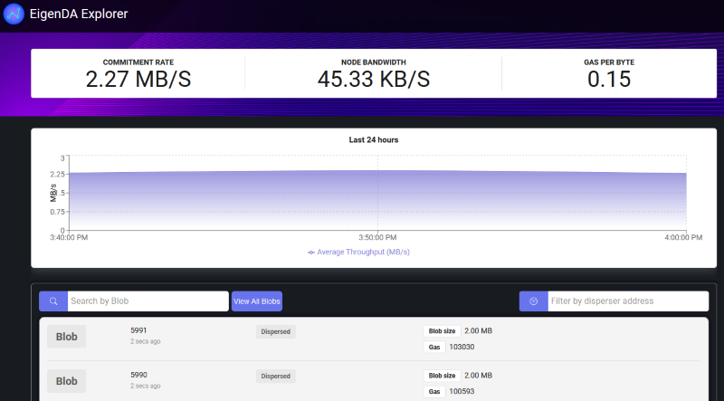

# EigenDA

## Overview

EigenDA is a secure, high-throughput, and decentralized data availability (DA) service built on top of Ethereum using the EigenLayer restaking ecosystem. To understand how EigenDA works and how it fits into the modern landscape of DA for blockchain applications, see the [DA Landscape](https://docs.eigenda.xyz/data-availability/) and [How EigenDA Works](https://docs.eigenda.xyz/how-it-works/) sections of our [docs](https://docs.eigenda.xyz/) (Accessing these pages will require you to log in using your github account).

Currently, EigenDA is running on a private devnet. If you’re reading this you should be authorized by LayrLabs to interact with the EigenDA devnet in the manners described within this Readme.

## About the devnet

The main purposes of the devnet are 1) to allow developers to understand how EigenDA works and what are its performance characteristics, and 2) to allow developers to begin the process of designing and building integrations with EigenDA, such as rollups.

The devnet consists of the following components which are managed by LayrLabs:
1. A private [PoA](https://en.wikipedia.org/wiki/Proof_of_authority) [Geth](https://geth.ethereum.org/docs/getting-started) chain consisting of one sealer node and several relay nodes, to which an instance of the EigenLayer and EigenDA contracts have been deployed.
2. 20 [operator nodes](https://docs.eigenda.xyz/how-it-works/protocol/components/) which have registered to be service providers with EigenLayer and EigenDA.
3. 4 [disperser nodes](https://docs.eigenda.xyz/how-it-works/protocol/components/) which are capable of posting data blobs to EigenDA by dispersing encoded chunks to the operator nodes and verifying their signatures on the EigenDA contract.
4. 1 [retriever node](https://docs.eigenda.xyz/how-it-works/protocol/components/) which is able to retrieve encoded chunks from the operator nodes and reconstruct the original data blob.
5. Chain indexing components and UI components for supporting a [block explorer](http://blocks.eigenda.xyz) and [blob explorer](http://blocks.eigenda.xyz) which can be used to view transactions on the private Geth chain and traffic on EigenDA.

In the services of the above purposes of understanding EigenDA and facilitating integration, authorized users can interact with the deployment of EigenDA in a number of ways, such as by 1) posting data to EigenDA via a hosted disperser, 2) posting data to EigenDA by running their own disperser, or even 3) deploying systems such as rollups which use EigenDA for data availability. In the following section, we overview some of these interactions.

### Devnet Status

See the [devnet page](https://github.com/Layr-Labs/datalayr/wiki/Rollup-Devnet-environment-and-port-allocation) of the wiki for the most recent information about contract addresses and URI's for devnet components such as dispersers and retrievers.

## Suggested devnet activities

This section contains information about the following modes of interacting with the devnet:
- Viewing traffic on the EigenDA blob explorer
- Posting and retrieving data to and from EigenDA using disperser and retriever services
- Running a rollup example test application on the EigenDA Devnet
- Building your own integration with the EigenDA Devnet

### Viewing traffic on EigenDA via the blob explorer

The EigenDA blob explorer, http://blobs.eigenda.xyz, displays blobs being posted to each of the EigenDA networks.

Check the blob explorer to view the current traffic on the EigenDA system, as well as statistics such as the current throughput of the system or the bandwidth used by the individual operator nodes.

### Dispersing a blob to EigenDA

GRPC interfaces exposed by the Devnet disperser and retriever [components](https://docs.eigenda.xyz/how-it-works/protocol/components/) can be used to disperse and retrieve data to and from the EigenDA deployment running on the devnet. The [dispersing and retrieving to and from devnet](.github/dispersal-to-devnet.md) quickstart guide provides steps for using the grpcurl commandline tool to interact with these interfaces.

### Running a rollup example test application on the EigenDA Devnet

A quick way to get started interacting with EigenDA is to run our [rollup example test application](middleware/rollup-example). The rollup example illustrates how to implement the optimistic rollup pattern using EigenDA for the availability of transaction data and Ethereum for executing fraud proofs. For simplicity, the logic of the rollup is modified from that of an actual rollup chain: In a normal [rollup pattern](https://docs.eigenda.xyz/build/rollups/), the challenge mechanisms of the rollup are used to ensure that the sequencer updates a state commitment in consistently with transactions posted to the DA layer; in constrast, our rollup example uses a challenge mechanism to ensure that the sequencer only posts blocks to the DA layer that satisfy a simple fraud conditition. However, the EigenDA integrations which are present in this rollup example should not change substantially in the context of a traditional rollup.

The rollup example consists of 1) a rollup contract which points to the Devnet EigenDA contract, 2) a rollup sequencer component, which registers blocks with the rollup contract and posts them to EigenDA, and 3) a rollup challenger component which checks each block for fraud, and conditionally posts fraud proofs to the rollup contract. See the rollup example [README](middleware/rollup-example/README.md) for instructions to deploy the rollup example contract, run the rollup components, and post traffic to the rollup.

### Building your own integration with EigenDA

For rollup developers wishing to build their own integrations with EigenDA, we suggest using the [rollup example](middleware/rollup-example) as a starting point. We provide several high level overviews and code walkthroughs at the [EigenDA docs](https://docs.eigenda.xyz/build/rollups/example/) website to help you get started.

## Running EigenDA locally

It is also possible to run an EigenDA devnet locally with a local Geth chain. For developers wishing to run EigenDA locally, see [Getting Started for Developers](.github/developers.md).

## Feedback and support links

If you have feedback or if you run into difficulties in performing any of the suggested devnet interactions, use the #create-a-ticket channel of the EigenDA discord in order to create a new ticket, and a LayrLabs developer will review your questions and/or feedback.
