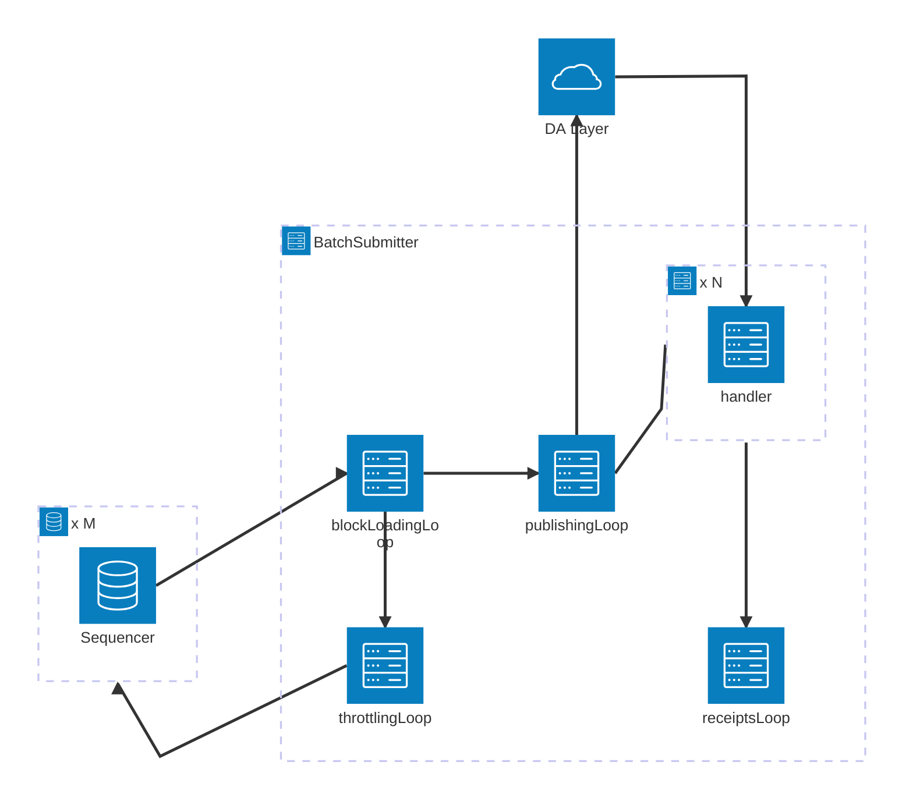

# op-batcher

The `op-batcher` is responsible for ensuring data availability. See the [specs](https://specs.optimism.io/protocol/batcher.html).

## Interactions & Dependencies

The `op-batcher` works together with the [sequencer](../op-node/) (which it reads unsafe blocks from), the data availability layer (e.g. Layer 1 or an [Alt DA](../op-alt-da/) layer, which it posts data to), and the [derivation pipeline](../op-node/) (which reads the data from the DA layer and progresses the safe chain).

It depends directly on some code shared with the derivation pipeline, namely the [`ChannelOut`](../op-node/rollup/derive/channel_out.go) implementation(s). It also depends directly on the shared [txmgr](../op-service/txmgr/) module.

## Testing

The batcher has a suite of unit test which can be triggered by running

```
go test ./...
```

from this directory. There are also end-to-end tests in [`op-e2e`](../op-e2e/) which integrate the batcher.

## Architecture

The architecture of this batcher implementation is shown on the left side of the following diagram:


Batch submitting (writing to the DA layer, in the middle of the diagram) works together with the derivation pipeline (on the right side of the diagram, reading from the DA layer) to progress the safe chain.

The philosophy behind the current architecture is:

- Blocks, channels and frames are kept around for as long as they might be needed, and discarded as soon as they are not needed. They are not moved from one part of state to another.
- We retain block data in a strict order for as long as necessary. We only garbage collect frames, channels and blocks when the safe head moves sufficiently and those structures have done their job.
- When something goes wrong, we rewind the state cursors by the minimal amount we need to get going again.

### Routines

The batcher has up to 4 main concurrent routines:

The `blockLoadingLoop`, which (in the happy path)

1. Queries the sequencer's syncStatus and
   a. (optionally) waits for it to ingest more L1 data before taking action
   b. prunes blocks and channels from its internal state which are no longer required
2. Enqueues unsafe blocks and dequeues safe blocks from the sequencer to the batcher's internal state.
3. Signals to the `publishingLoop` and to the `throttlingLoop` when new blocks are loaded

The `publishingLoop` which

1. Waits for a signal from the `blockLoadingLoop`
2. Enqueues a new channel, if necessary.
3. Processes some unprocessed blocks into the current channel, triggers the compression of the block data and the creation of frames.
4. Sends frames from the channel queue to the DA layer as (e.g. to Ethereum L1 as calldata or blob transactions).
5. If there is more transaction data to send, go to 2. Else go to 1.

The `receiptsLoop` which

1. Receives receipts from handlers spawned by the `publishingLoop`.
2. Updates metrics
3. (Conditionally) Modifies the batcher state to cope when a channel times out on chain (see below).

The `throttlingLoop` which

1. Waits for a signal from the `blockLoadingLoop`
2. Calls (potentially multiple) sequencers over RPC and tells them to throttle or unthrottle -- that is, to limit (or not) the amount of L2 data they produce. See the (section below)[#data-availability-backlog]. Each sequencer is throttled in parallel by a separate sub-goroutine (not shown in the below diagram). Additional endpoints, such as builders in a rollup-boost setup, may also be configured to be throttled.

The relationships are shown in this diagram:



### State variables

The `blockCursor` state variable tracks the next unprocessed block.
In each channel, the `frameCursor` tracks the next unsent frame.

### Reorgs

When an L2 unsafe reorg is detected, the batch submitter will reset its state, and wait for any in flight transactions to be ingested by the verifier nodes before starting work again.

### Tx Failed

When a Tx fails, an asynchronous receipts handler is triggered. The channel from whence the Tx's frames came has its `frameCursor` rewound, so that all the frames can be resubmitted in order.

### Channel Times Out

When a Tx is confirmed, an asynchronous receipts handler is triggered. We only update the batcher's state if the channel timed out on chain. In that case, the `blockCursor` is rewound to the first block added to that channel, and the channel queue is cleared out. This allows the batcher to start fresh building a new channel starting from the same block -- it does not need to refetch blocks from the sequencer.

## Design Principles and Optimization Targets

At the current time, the batcher should be optimized for correctness, simplicity and robustness. It is considered preferable to prioritize these properties, even at the expense of other potentially desirable properties such as frugality. For example, it is preferable to have the batcher resubmit some data from time to time ("wasting" money on data availability costs) instead of avoiding that by e.g. adding some persistent state to the batcher.

The batcher can almost always recover from unforeseen situations by being restarted.

Some complexity is permitted, however, for handling data availability switching, so that the batcher is not wasting money for longer periods of time.

### Data Availability Backlog

A chain can potentially experience an influx of large transactions whose data availability requirements exceed the total
throughput of the data availability layer. While this situation might resolve on its own in the long term through the
data availability pricing mechanism, in practice this feedback loop is too slow to prevent a very large backlog of data
from being produced, even at a relatively low cost to whomever is submitting the large transactions. In such
circumstances, the safe head can fall significantly behind the unsafe head, and the time between seeing a transaction
(and charging it a given L1 data fee) and actually posting the transaction to the data availability layer grows larger
and larger. Because DA costs can rise quickly during such an event, the batcher can end up paying far more to post the
transaction to the DA layer than what can be recovered from the transaction's data fee.

To prevent a significant DA backlog, the batcher can instruct the block builder (via op-geth's miner RPC API) to impose
thresholds on the total DA requirements of a single block, and/or the maximum DA requirement of any single
transaction. In the happy case, the batcher instructs the block builder to impose a block-level DA limit of
OP_BATCHER_THROTTLE_ALWAYS_BLOCK_SIZE, and imposes no additional limit on the DA requirements of a single
transaction. But in the case of a DA backlog (as defined by OP_BATCHER_THROTTLE_THRESHOLD), the batcher instructs the
block builder to instead impose a (tighter) block level limit of OP_BATCHER_THROTTLE_BLOCK_SIZE, and a single
transaction limit of OP_BATCHER_THROTTLE_TRANSACTION_SIZE.

### Enhanced DA Throttling Mechanisms

The batcher includes sophisticated throttling mechanisms to manage data availability backlogs and prevent excessive costs during high-load periods. These mechanisms support multiple control strategies, from simple binary throttling to advanced PID control systems.

**Key Features:**
- **Multiple Controller Types**: Step (binary), Linear, Quadratic, and PID controllers
- **Runtime Management**: Switch between controllers via RPC without restarts
- **Dynamic Response**: Automatically adjust throttling intensity based on DA load
- **Multi-endpoint Support**: Throttle sequencers, builders, and other endpoints in parallel
- **Comprehensive Monitoring**: Built-in metrics and diagnostic tools

**Quick Start:**
```bash
# Configure basic throttling
--throttle-threshold=1000000
--throttle-controller-type=quadratic

# Runtime controller switching
curl -X POST -H "Content-Type: application/json" \
  --data '{"jsonrpc":"2.0","method":"admin_getThrottleController","params":[],"id":1}' \
  http://localhost:8545
```

**📖 For complete documentation, configuration guides, and troubleshooting, see [Enhanced DA Throttling Mechanisms](./throttling.md)**

### Max Channel Duration

The batcher tries to ensure that batches are posted at a minimum frequency specified by `MAX_CHANNEL_DURATION`. To achieve this, it caches the l1 origin of the last submitted channel, and will force close a channel if the timestamp of the l1 head moves beyond the timestamp of that l1 origin plus `MAX_CHANNEL_DURATION`. When clearing its state, e.g. following the detection of a reorg, the batcher will not clear the cached l1 origin: this way, the regular posting of batches will not be disturbed by events like reorgs.

## Known issues and future work

Link to [open issues with the `op-batcher` tag](https://github.com/ethereum-optimism/optimism/issues?q=is%3Aopen+is%3Aissue+label%3AA-op-batcher).

The batcher launches L1 transactions in parallel so that it can achieve higher throughput, particularly in situations where there is a large backlog of data which needs to be posted. Sometimes, transactions can get stuck in the L1 mempool. The batcher does have functionality to clear these stuck transactions, but it is not completely reliable.

The automatic data availability switching behavior is a somewhat new feature which may still have some bugs in it.
