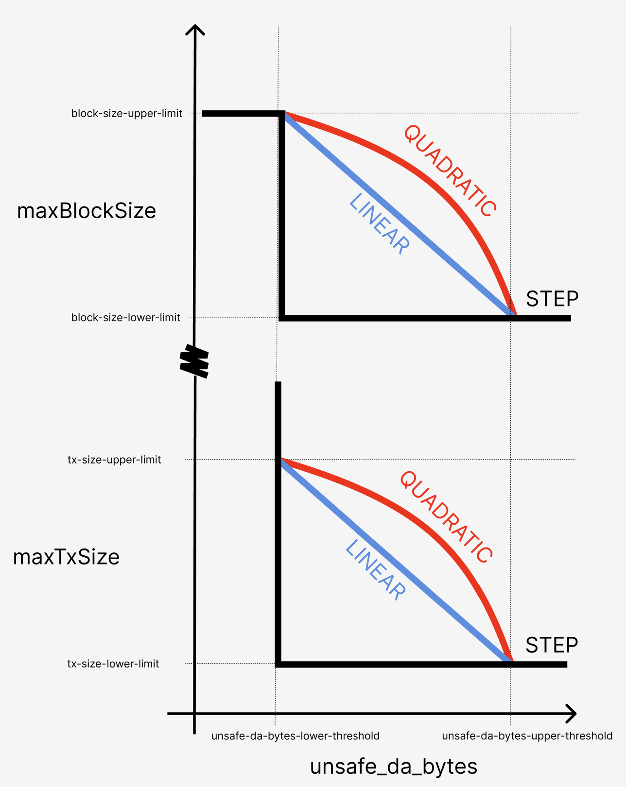

# Enhanced DA Throttling Mechanisms

The `op-batcher` includes sophisticated throttling mechanisms to manage data availability (DA) backlogs and prevent excessive costs during high-load periods. These mechanisms dynamically adjust block building constraints based on current DA load.

## Overview

Data availability throttling addresses situations where transaction volume exceeds the DA layer's throughput capacity. Without throttling, this can lead to:

- Large backlogs of pending data
- Significant delays between transaction submission and DA posting
- Substantial cost overruns when DA prices spike during posting
- Degraded user experience due to delayed transaction finalization

The throttling system prevents these issues by instructing sequencers to limit block data production when backlogs exceed configured thresholds.

## Throttling Controller Types

The batcher supports four throttling strategies, each with different response characteristics. The strategies can be understood in this
diagram:


* Each strategy responds to the `unsafe_da_bytes` metric and corresponding thresholds `throttle.unsafe-da-bytes-lower/upper-threshold`, and results a throttling "intensity" between 0 and 1.

* This intensity is then mapped to a maximum tx size and maximum block size to control the `miner_setMaxDASize(maxTxSize, maxBlockSize)` API calls made to block builders, depending on the configuration variables shown in the diagram above.

* When the throttling intensity is zero (the `unsafe_da_bytes` is less than `unsafe-da-bytes-lower-threshold`), blocks will continue to be limited at `throttle.block-size-upper-limit`, whereas transactions are not throttled at all (by using `maxTxSize=0`).

> NOTE
> Be aware that using `0` for either
> `throttle.block-size-lower-limit` and `throttle.tx-size-lower-limit`
> results in no throttling limits being applied (for blocks and transactions respectively).

### Step Controller (Default)

**Behavior**: Binary on/off throttling
- **Below threshold**: No throttling applied
- **Above threshold**: Maximum throttling applied immediately
- **Use case**: Simple, predictable throttling behavior
- **Best for**: Environments requiring clear, binary throttling states

> [!WARNING]
> If selecting the step controller, you should **not** rely on default throttling parameters as this could cause too much throttling to be applied too quickly.

### Linear Controller

**Behavior**: Linear scaling throttling intensity
- **Response curve**: Gradual increase from threshold to maximum threshold
- **Scaling**: Throttling intensity = (current_load - threshold) / (max_threshold - threshold)
- **Use case**: Moderate, proportional response to load increases
- **Best for**: Steady load patterns with predictable growth

### Quadratic Controller

**Behavior**: Quadratic scaling throttling intensity
- **Low overload**: Gentle throttling response
- **High overload**: Aggressive throttling response
- **Scaling**: More tolerant of brief spikes, strong response to sustained overload
- **Use case**: Environments with occasional spikes but need strong protection against sustained overload
- **Best for**: Variable load patterns with tolerance for brief excursions

### PID Controller (⚠️ EXPERIMENTAL)
[What a PID Controller is](https://en.wikipedia.org/wiki/Proportional%E2%80%93integral%E2%80%93derivative_controller)

PID Controller is a control mechanism that automatically adjusts the batcher's throttling intensity output to maintain a desired load.

**Behavior**: Proportional-Integral-Derivative control
- **Proportional**: Immediate response to current error
- **Integral**: Corrects for accumulated error over time
- **Derivative**: Anticipates future error based on current rate of change
- **Use case**: Complex load patterns requiring precise control and minimal overshoot
- **Best for**: Expert users with control theory knowledge

> ⚠️ **EXPERIMENTAL FEATURE WARNING**
>
> The PID controller is experimental and should only be used by users with deep understanding of control theory. Improper configuration can lead to system instability, oscillations, or poor performance. Use at your own risk and only with extensive testing.

## Runtime Management via RPC

The batcher exposes admin RPC endpoints for dynamic throttling control without restarts:

### Get Controller Status
```bash
curl -X POST -H "Content-Type: application/json" \
  --data '{"jsonrpc":"2.0","method":"admin_getThrottleController","params":[],"id":1}' \
  http://localhost:8545
```

**Response:**
```json
{
  "jsonrpc": "2.0",
  "result": {
    "type": "quadratic",
    "threshold": 1000000,
    "current_load": 750000,
    "intensity": 0.25,
    "max_tx_size": 128000,
    "max_block_size": 1500000
  },
  "id": 1
}
```

### Switch Controller Type

**Step Controller:**
```bash
curl -X POST -H "Content-Type: application/json" \
  --data '{"jsonrpc":"2.0","method":"admin_setThrottleController","params":["step", null],"id":1}' \
  http://localhost:8545
```

**Linear Controller:**
```bash
curl -X POST -H "Content-Type: application/json" \
  --data '{"jsonrpc":"2.0","method":"admin_setThrottleController","params":["linear", null],"id":1}' \
  http://localhost:8545
```

**Quadratic Controller:**
```bash
curl -X POST -H "Content-Type: application/json" \
  --data '{"jsonrpc":"2.0","method":"admin_setThrottleController","params":["quadratic", null],"id":1}' \
  http://localhost:8545
```

**PID Controller:**
```bash
curl -X POST -H "Content-Type: application/json" \
  --data '{"jsonrpc":"2.0","method":"admin_setThrottleController","params":["pid", {"kp": 0.3, "ki": 0.15, "kd": 0.08, "integral_max": 50.0, "output_max": 1.0, "sample_time": "5s"}],"id":1}' \
  http://localhost:8545
```

### Reset Controller State
```bash
curl -X POST -H "Content-Type: application/json" \
  --data '{"jsonrpc":"2.0","method":"admin_resetThrottleController","params":[],"id":1}' \
  http://localhost:8545
```

## PID Controller Configuration

### Parameters

The PID controller uses six key parameters:

**Core PID Parameters:**
- `kp` (Proportional Gain): Controls immediate response to current error
  - Higher values: Faster response but may cause overshoot
  - Lower values: Slower response but more stable
- `ki` (Integral Gain): Controls response to accumulated error over time
  - Higher values: Faster elimination of steady-state error
  - Lower values: Slower correction but less prone to oscillation
- `kd` (Derivative Gain): Controls response to rate of error change
  - Higher values: Better anticipation of future error
  - Lower values: Less noise sensitivity but slower prediction

**Protection Parameters:**
- `integral_max`: Maximum accumulated integral to prevent windup
- `output_max`: Maximum controller output (typically 1.0)
- `sample_time`: Controller update frequency (nanoseconds, e.g., 5000000000 = 5ms)

### Predefined Profiles

> ⚠️ **EXPERIMENTAL**: These profiles are starting points only. Proper tuning requires understanding your specific system characteristics and extensive testing.

**Gentle Throttling** (Conservative, stable):
```json
{
  "kp": 0.1,
  "ki": 0.05,
  "kd": 0.02,
  "integral_max": 1000.0,
  "output_max": 1.0,
  "sample_time": "10s"
}
```
- Slow, stable response
- Minimal overshoot
- Good for predictable loads

**Balanced Throttling** (Recommended default):
```json
{
  "kp": 0.3,
  "ki": 0.15,
  "kd": 0.08,
  "integral_max": 1000.0,
  "output_max": 1.0,
  "sample_time": "2s"
}
```
- Balanced responsiveness and stability
- General-purpose throttling
- Good starting point for most scenarios

**Aggressive Throttling** (Fast response, may overshoot):
```json
{
  "kp": 0.8,
  "ki": 0.4,
  "kd": 0.2,
  "integral_max": 2000.0,
  "output_max": 1.0,
  "sample_time": "2s"
}
```
- Fast response to load changes
- Good for highly variable loads
- May overshoot and oscillate

### Tuning Guidelines

> ⚠️ **WARNING**: PID tuning requires expertise. Improper tuning can cause instability.

1. **Start Conservative**: Begin with gentle settings and gradually increase responsiveness
2. **Tune One Parameter at a Time**: Change kp first, then ki, then kd
3. **Monitor System Response**: Watch for oscillations, overshoot, and stability
4. **Test Under Load**: Validate behavior under various load conditions
5. **Have Rollback Plan**: Be prepared to switch back to step/linear controllers

**Basic Tuning Process:**
1. Set ki=0, kd=0, start with small kp (0.1)
2. Increase kp until system responds adequately without overshoot
3. Add small ki (0.05) to eliminate steady-state error
4. Add small kd (0.02) to improve transient response
5. Adjust integral_max to prevent windup
6. Fine-tune based on observed behavior

## Throttling Operation

### How It Works

1. **Monitoring**: Batcher continuously monitors pending DA bytes in its queue
2. **Threshold Checking**: Compares current load against configured threshold
3. **Intensity Calculation**: Controller calculates throttling intensity (0.0 to 1.0)
4. **Parameter Mapping**: Intensity maps to specific tx/block size limits
5. **Endpoint Updates**: Sends `miner_setMaxDASize` RPC calls to configured endpoints
6. **Enforcement**: Sequencers/builders enforce the limits during block construction

### Endpoint Communication

The throttling system communicates with multiple endpoints in parallel:

- **Primary sequencer endpoints**: Configured via `--l2-eth-rpc`
- **Additional endpoints**: Configured via `--additional-throttling-endpoints`
- **Builder endpoints**: In rollup-boost setups, builders receive throttling signals

Each endpoint runs in its own goroutine with:
- **Retry logic**: Automatic retries for failed RPC calls
- **Error handling**: Graceful handling of unavailable endpoints
- **Parallel updates**: All endpoints updated simultaneously

### Metrics and Monitoring

The batcher exposes Prometheus metrics for throttling monitoring:

- `op_batcher_throttle_intensity`: Current throttling intensity (0.0-1.0)
- `op_batcher_throttle_pending_bytes`: Current pending DA bytes
- `op_batcher_throttle_max_tx_size`: Current max transaction size limit
- `op_batcher_throttle_max_block_size`: Current max block size limit
- `op_batcher_throttle_controller_type`: Current controller type
- `op_batcher_throttle_pid_error`: PID controller error term (PID only)
- `op_batcher_throttle_pid_integral`: PID controller integral term (PID only)
- `op_batcher_throttle_pid_derivative`: PID controller derivative term (PID only)

## Best Practices

### Controller Selection

**Use Step Controller when:**
- Simple, predictable behavior is required
- Binary throttling states are acceptable
- Minimal configuration complexity is desired

**Use Linear Controller when:**
- Gradual response to load changes is preferred
- Load patterns are relatively steady
- Proportional throttling is sufficient

**Use Quadratic Controller when:**
- Tolerance for brief load spikes is needed
- Strong protection against sustained overload is required
- Variable load patterns are common

**Use PID Controller when:**
- Expert control theory knowledge is available
- Complex load patterns require sophisticated control
- Extensive testing and tuning resources are available
- Experimental features are acceptable

### General Recommendations

1. **Start Simple**: Begin with step or linear controllers
2. **Monitor Closely**: Watch metrics and system behavior
3. **Test Thoroughly**: Validate under various load conditions
4. **Plan for Failure**: Have fallback controllers configured
5. **Document Changes**: Record configuration changes and their effects
6. **Regular Review**: Periodically assess controller performance

### Common Pitfalls

- **Over-tuning**: Making too many adjustments too quickly
- **Ignoring Metrics**: Not monitoring system response to changes
- **Production Testing**: Testing new controllers directly in production
- **Parameter Copying**: Using other systems' PID parameters without validation
- **Insufficient Monitoring**: Not tracking key performance indicators

## Troubleshooting

### Common Issues

**Controller Not Responding:**
- Check RPC connectivity to endpoints
- Verify `miner_setMaxDASize` method availability
- Confirm threshold configuration is correct

**Oscillating Behavior (PID):**
- Reduce proportional gain (kp)
- Decrease derivative gain (kd)
- Increase sample time
- Check for noise in load measurements

**Slow Response:**
- Increase proportional gain (kp)
- Decrease sample time
- Check threshold multiplier settings

**High Error Rates:**
- Verify endpoint availability
- Check network connectivity
- Review retry logic configuration

### Diagnostic Commands

**Check controller status:**
```bash
curl -s -X POST -H "Content-Type: application/json" \
  --data '{"jsonrpc":"2.0","method":"admin_getThrottleController","params":[],"id":1}' \
  http://localhost:8545 | jq
```

**Reset and start fresh:**
```bash
curl -X POST -H "Content-Type: application/json" \
  --data '{"jsonrpc":"2.0","method":"admin_resetThrottleController","params":[],"id":1}' \
  http://localhost:8545
```

**Switch to safe mode (step controller):**
```bash
curl -X POST -H "Content-Type: application/json" \
  --data '{"jsonrpc":"2.0","method":"admin_setThrottleController","params":["step", null],"id":1}' \
  http://localhost:8545
```
