# Optimism Interop Monitor

## Purpose
The Optimism Interop Monitor is a service that monitors Executing Messages between OP Protocol chains to detect and report any invalid messages on chains. It helps ensure the reliability and correctness of cross-chain communication.

Interop Monitor's primary output is a collection of metrics which can alert operators for fast response and insight.
The design of this service follows the [Design Doc](https://github.com/ethereum-optimism/design-docs/pull/222).

## Architecture
The service consists of several key components working together:

- A main service (`InteropMonitorService`) that coordinates everything
- A set of RPC Clients specified from command line, and given to each sub-component
- Multiple `Finder` instances that scan chains for relevant transactions
- Multiple `Updater` instances that take `job`s for their chain and update them
- A `MetricCollector` that regularly scans ongoing jobs to emit gauge metrics

The components use a collection of channels, callbacks and visitor-pattern style data collection to share Job information.

```mermaid
flowchart TD

  subgraph execution-client A
    ra[RPC]
  end

  subgraph execution-client B
    rb[RPC]
  end

  subgraph grafana
   g[Grafana]
  end

  %% Main Monitoring Group
  subgraph service["op-interop-mon"]
    s[Service Routing]
    m[Metric Collector]
    fa[Chain A Finder]
    fb[Chain B Finder]
    ua[Chain A Updater️]
    ub[Chain B Updater]
  end

  ra --"New Unsafe and Finalized Blocks"--> fa
  ra --"Receipt Data for EM Validation"--> ua
  fa --"Executing Messages and Finalized Block Info" --> s
  s --"New Jobs and Finalized Block Info" --> ub
  rb --"New Unsafe and Finalized Blocks"--> fb
  rb --"Receipt Data for EM Validation"--> ub
  fb --"Executing Messages and Finalized Block Info" --> s
  s --"New Jobs and Finalized Block Info" --> ua
  ua --"All Current Jobs"--> m
  ub --"All Current Jobs"--> m
  m --"Executing and Initiating Message Prometheus Stats"--> g

```

## MetricCollector
The `MetricCollector` consolidates metrics from all jobs across chains. It:

- Scans all jobs from all updaters periodically
- Tracks executing message metrics by:
  - Chain ID
  - Block number
  - Block hash
  - Message status
- Tracks initiating message metrics by:
  - Chain ID
  - Block number
  - Message status
- Detects and records terminal state changes (valid->invalid or invalid->valid)
- Emits metrics for:
  - Executing message stats per chain/block/status
  - Initiating message stats per chain/block/status
  - Terminal status changes between chains

### Updaters
`Updater`s are chain specific processors that take `job`s and update them:
- Maintains a map of all `job`s it is updating
- Evaluates all `job`s regularly
- Expires old `job`s based on Finality of both Initiating and Executing side
- Operates independently per chain

## Finders
`Finder`s scan individual chains for relevant transactions. Each Finder:

- Subscribes to new blocks on its assigned chain
- Processes block receipts to identify Executing Messages
- Creates `job`s for each relevant transaction found
- Sends `job`s to the Finders (via a centralized router)
- Operates independently per chain

## Jobs
`job`s represent individual Executing Messages that need to be tracked. A `job` contains:

- Timestamps for first/last seen
- Transaction hashes and Initiating/Executing identifiers
- Current status and status history
- More, as needed by the service

`job`s move through different states (unknown -> valid/invalid/missing) as the updater processes them.
