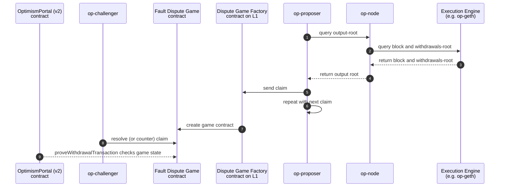

# `op-proposer`

Issues: [monorepo](https://github.com/ethereum-optimism/optimism/issues?q=is%3Aissue%20state%3Aopen%20label%3AA-op-proposer)

Pull requests: [monorepo](https://github.com/ethereum-optimism/optimism/pulls?q=is%3Aopen+is%3Apr+label%3AA-op-proposer)

User docs:
- [Proposer Configuration docs]

[Proposer Configuration docs]: https://docs.optimism.io/builders/chain-operators/configuration/proposer

Specs:
- [`proposals.md`](https://github.com/ethereum-optimism/specs/blob/main/specs/protocol/proposals.md)
- [`withdrawals`](https://github.com/ethereum-optimism/specs/blob/main/specs/protocol/withdrawals.md)
- [`fault-proof/stage-one/bridge-integration.md`](https://github.com/ethereum-optimism/specs/blob/main/specs/fault-proof/stage-one/bridge-integration.md)

The `op-proposer` is a light-weight service to automate output-root proposal transactions on regular interval.
Each proposal transaction submits a claim of the L2 state to L1.

Chains with a pre-Fault-Proof deployment make proposal-transactions towards a pre-fault-proofs `OptimismPortal` deployment.

Chains with permissioned or permissionless Fault Proofs make proposal-transactions to the `DisputeGameFactory`,
which instantiates claims (each claim being a new fault-proof "game"),
which can then be resolved for the proposals to persist.

Withdrawals are authenticated against resolved proposals,
with an inclusion-proof of a withdrawn message (as registered in the L2 withdrawal-contract storage).

## Quickstart

```bash
go run ./op-proposer/cmd \
        --l1-eth-rpc http://l1:8545 \
      --rollup-rpc: http://op-node:8545 \
      --game-factory-address=changeme \
      --game-type=changeme
```

See [Proposer Configuration docs] for customization of the transaction-management,
and usage of a remote signer to isolate the proposer secret key.

On test networks, `--allow-non-finalized` may be used to make proposals sooner, to reduce test time.

## Usage

### Build from source

```bash
# from op-proposer dir:
just op-proposer

./bin/op-proposer --help
```

### Run from source

```bash
# from op-proposer dir:
go run ./cmd --help
```

### Build docker image

See `op-proposer` docker-bake target.

## Overview

<!-- description of *how* this module implements the spec -->

The op-proposer relays subjective `finalized` blocks (irreversible, as locally verified)
to L1 by constructing and submitting proposals.
The proposed claims can then be resolved, and used for withdrawals on L1.



The `op-proposer` itself is a light-weight loop to maintain this relay:
schedule when to propose, inspect what to propose, transact on L1 to proposer, and repeat.

## Product

### Optimization target

The `op-proposer` code optimizes for simplicity.

Proposals are few and far-between, commonly only at a 1 hour interval.
Proposal execution speed affects tests more than it does production, and thus not a primary optimization target.

Most costs are made in the proposal contract execution,
not the operation of the op-proposer, and thus not the primary optimization concern.

Proposals are critical to safety however, and simplicity is thus important to this service.

### Vision

The pre-fault-proof proposal functionality is effectively unused code, and may be removed in the near future.
Solutions for alternative proving systems are a work in progress.

With the proposed withdrawals-root feature (see [Isthmus upgrade feature]),
the op-node will soon no longer have to query the storage separately
from the block-header that it constructs an output-root for.
This lowers the requirements to run a proposer,
since no archive-node is required anymore to determine the withdrawals-root.

[Isthmus upgrade feature]: https://github.com/ethereum-optimism/specs/blob/main/specs/protocol/isthmus/exec-engine.md#l2tol1messagepasser-storage-root-in-header

Testing of this service may be further improved by decoupling the scheduling and processing.
Better encapsulated processing would lend itself better to [op-e2e](../op-e2e) action-tests.


## Design principles

<!-- design choices / trade-offs -->

- Reuse the transaction-management: this is the most complicated part of the op-proposer, but is common with other services.
- Keep the proposal flow simple: given that we only expect one transaction per hour,
  but the transaction is a critical claim, we have a strong preference for safety over liveness.

## Failure modes

<!-- Risks & error handling -->

While disabled by default, the op-proposer is capable of submitting proposals too eagerly.
A proposal for unfinalized L2 state that does not hold true later may result in an invalid claim on L1,
and thus in dispute-game penalties.

Assuming finality, the op-proposer is only really subject to liveness failures:
- to L1 RPC failure (mitigated with redundancy in L1 RPC)
- local temporary failure, e.g. offline execution engine (mitigated with alerts)
  or odd tx-inclusion situations (mitigated with fresh state upon restart).

## Testing

The `op-proposer` integration is covered in system `op-e2e` tests.
