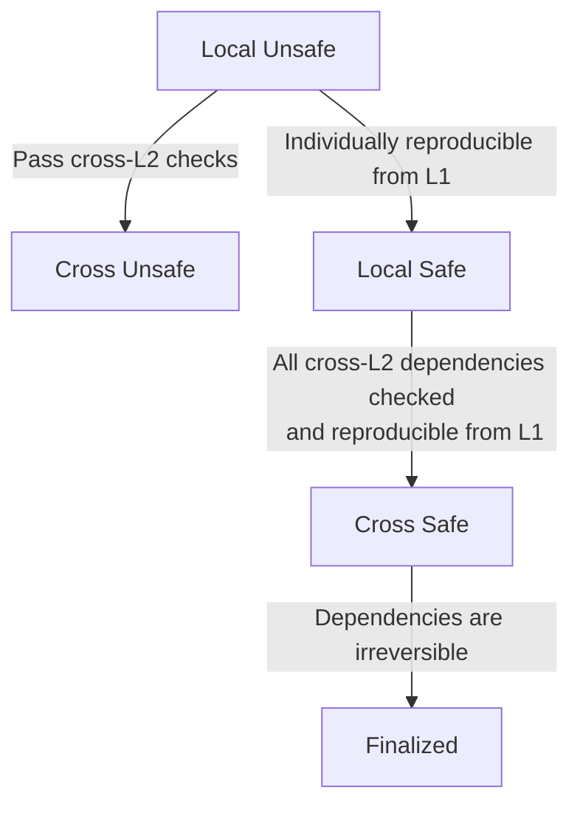
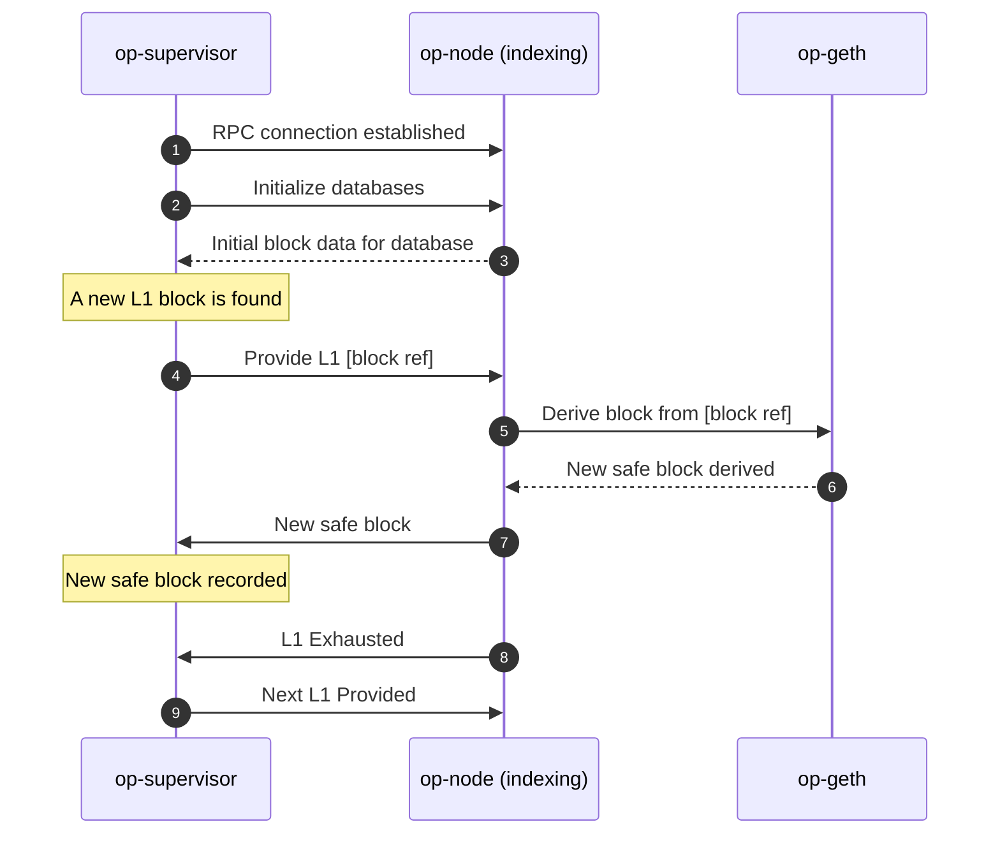
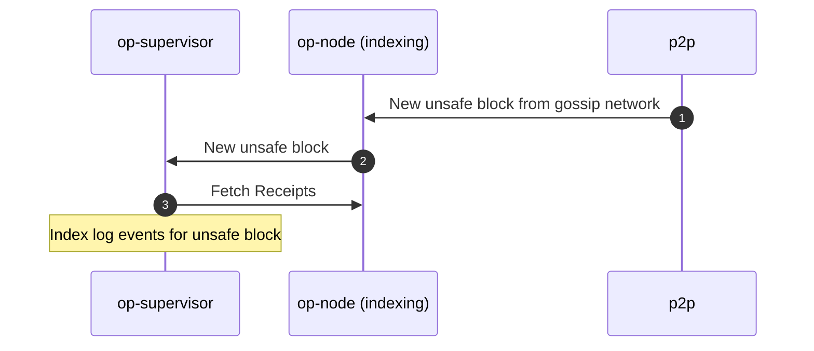
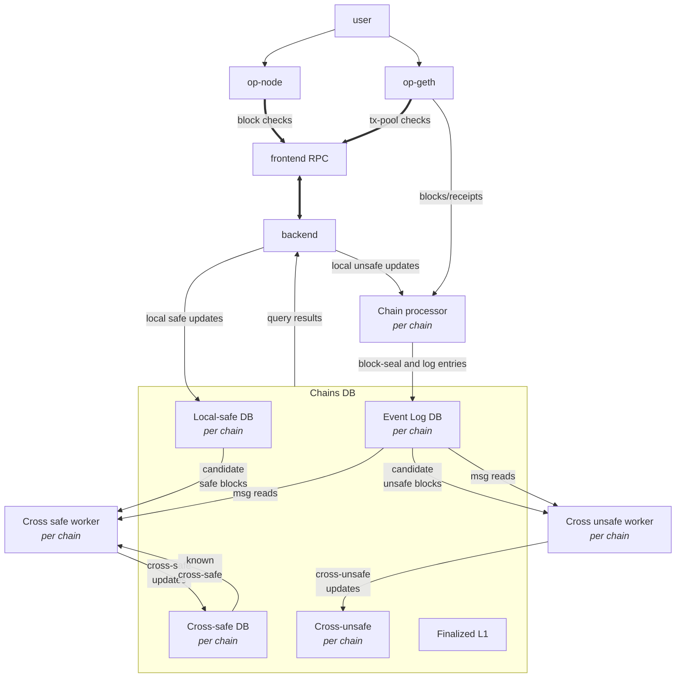
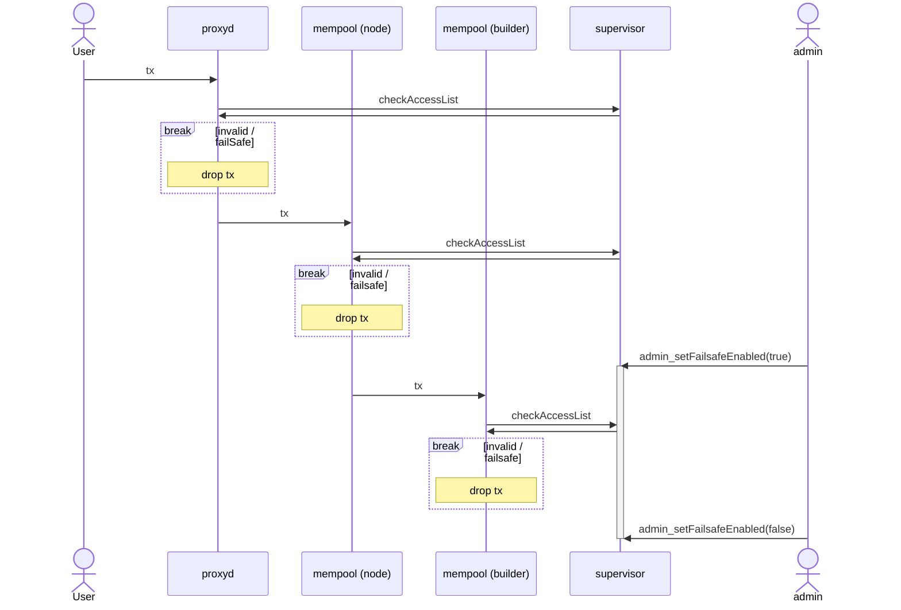

# `op-supervisor`

Issues: [monorepo](https://github.com/ethereum-optimism/optimism/issues?q=is%3Aissue%20state%3Aopen%20label%3AA-op-supervisor)

Pull requests: [monorepo](https://github.com/ethereum-optimism/optimism/pulls?q=is%3Aopen+is%3Apr+label%3AA-op-supervisor)

User docs:
- [op-supervisor](https://docs.optimism.io/stack/interop/op-supervisor)

Specs:
- [interop specs]

`op-supervisor` is a service to monitor chains, and quickly determine
cross-chain message safety, for native interoperability.
The `op-supervisor` functions as a [superchain backend], implementing the [interop specs].

[superchain backend]: https://github.com/ethereum-optimism/design-docs/blob/main/protocol/superchain-backend.md
[interop specs]: https://github.com/ethereum-optimism/specs/tree/main/specs/interop

*Warning: this implementation is a work in progress, in active development.*


## Quickstart

```bash
make op-supervisor

# Key configurables:
# datadir: where to store indexed interop data
# dependency-set: where to find chain dependencies (this format is changing, and may be fully onchain in a later iteration)
# l2-rpcs: L2 RPC endpoints to fetch data from (optional, can also be added using the `admin_addL2RPC in the admin-RPC)
./bin/op-supervisor \
  --datadir="./op-supervisor-data" \
  --dependency-set="./my-network-configs/dependency-set.json" \
  --l2-rpcs="ws://example1:8545,ws://example2:8545" \
  --rpc.enable-admin \
  --rpc.port=8545
```

## Usage

### Build from source

```bash
# from op-supervisor dir:
make op-supervisor
./bin/op-supervisor --help
```

### Run from source

```bash
# from op-supervisor dir:
go run ./cmd --help
```

### Build docker image

See `op-supervisor` docker-bake target.

## Overview

### About safety

There are 3 stages of block safety:

- `unsafe`: optimistically processed blocks
- `safe`: blocks reproducible from valid dependencies
- `finalized`: blocks reproducible from irreversibly valid dependencies

**Pre-interop**, the only dependency is DA (data availability), i.e. the batch data to derive the chain from.
**Post-interop**, other L2s may be a dependency also.
The op-supervisor tracks these dependencies, to maintain a global view of cross-chain message safety.

New blocks are considered `local unsafe`: sufficient to process the block locally, without guarantees.
Once the L2 dependencies are met we consider it `cross unsafe`: still missing DA, but forming a valid messaging graph.

Once the DA dependency is met, we consider it `local safe`:
enough to reproduce the local L2 chain content, but not to reason about cross-L2 interactions.

Once both L2 and DA dependencies are met, we consider it `cross safe`.
A `cross-safe` block may be "derived from" a L1 block that confirms all L2 data to reproduce
the local chain as well as the cross-L2 dependencies.
Hence this may take additional L1 data, beyond what a `local safe` block is derived from.

And once the dependencies become irreversibly valid, we consider it `finalized`.
We can thus look at what `cross-safe` has been derived from, and verify against the



### Control flow

Op-nodes, or any compatible consensus-layer L2 node can interact with op-supervisor in two modes:

#### Indexing Mode

In indexing mode, nodes cede control over aspects of the derivation process to the supervisor, which maintains the node's sync status.
This is done to give the supervisor a clear picture of the data across multiple chains, and to ensure the supervisor can recover/reset as needed.

Indexing nodes can be thought of integral to the supervisor. There must be *at least* one indexing node per chain connected
to a supervisor for it to supply accurate data.

The Supervisor subscribes to events from the op-node in order to react appropriately.
In turn, op-supervisor sends signals to the op-node to manage its derivation pipeline or maintain databases:

| op-node event | op-supervisor control |
|-------|---------|
| When new unsafe blocks are added  | Supervisor fetches receipts for database indexing |
| When a new safe block is derived from an L1 block | Supervisor records the L1:L2 derivation information to the database |
| When an L1 block is fully derived | Supervisor provides the next L1 block |
| When the node resets is derivation pipeline | Supervisor provides a reset signal targeting blocks known in the database |

Additionally, the supervisor sends control signals to the op-node triggered by *database updates* in order to inform the node of cross-safety levels:
| database event | op-supervisor control |
|-------|---------|
| New cross-unsafe head  | Supervisor sends the head to the node, where it is recorded as the cross-unsafe head |
| New cross-safe head  | Supervisor sends the head to the node, where it is recorded as the cross-safe head |
| New finalized head  | Supervisor sends the head to the node, where it is recorded as the finalized head |

Nodes in indexing mode *do not* discover their own L1 blocks.
Instead, the supervisor watches the L1 and sends the block hash to the node, which is used instead of L1 traversal.
In this way, all indexing nodes are guaranteed to share the same L1 chain, and their data can be aggregated consistently.

#### Following Mode
(Following mode is in development)

In following mode, an `op-node` continues to handle derivation and L1 discovery as it would without a supervisor.
However, it calls out to the supervisor periodically to update its cross-heads. Following nodes do not affect the supervisor's data in any way.

In this way, following nodes can optimistically follow cross-safety without requiring the larger infrastructure of multiple nodes and a supervisor.

### Data Flow Visualization

#### Initialization and Derivation Updates


#### Indexing Updates


### Databases

The op-supervisor maintains a few databases:
- Log database (`events` kind): per chain, we maintain a running list of log-events,
  separated by block-seals.
  I.e. this persists the cross-L2 dependency information.
- `local safe` (`fromda` kind): per chain, we store which L2 block
  was locally derived from which L1 block.
  I.e. this persists the DA dependency information.
- `cross safe` (`fromda` kind): per chain, we store which L2 block
  became cross-safe, given all the L2 data available, at which L1 block.
  I.e. this persists the merged results of verifying both DA and cross-L2 dependencies.

Additionally, the op-supervisor tracks `cross unsafe` in memory, not persisting it to a database:
it can quickly reproduce this after data-loss by verifying if cross-L2 dependencies
are met by `unsafe` data, starting from the latest known `cross safe` block.

The latest `L1 finalized` block is tracked ephemerally as well:
the `L2 finalized` block is determined dynamically,
given what was `cross safe` at this finalized point in L1.

For both the `events` and `fromda` DB kinds an append-only format was chosen
to make the database efficient and robust:
data can be read in parallel, does not require compaction (a known problem with execution-layer databases),
and data can always be rewound to a previous consistent state by truncating to a checkpoint.
The database can be searched with binary lookups, and written with O(1) appends.

### Internal Architecture



Main components:
- `frontend`: public API surface
- `backend`: implements the API (updates, queries, reorgs)
- `ChainsDB`: hosts the databases, one of each kind, per chain
- `Chain processor`: indexes blocks/events, including unsafe blocks
- `Cross-unsafe worker`: updates cross-unsafe, by cross-verifying unsafe data
- `Cross-safe worker`: updates cross-safe, by cross-verifying safe data within a L1 view

Note that the `cross-unsafe` worker operates on any available L2 dependency data,
whereas the `cross-safe` worker incrementally expands the L1 scope,
to capture the `cross-safe` state relative to each L1 block.

Most supervisor branching logic deals with the edge-cases that come with
syncing dependency data, and updating the safety views as the dependencies change.
This is where the service differs most from interop development simulations:
*dependency verification is critical to safety*,
and requires dependencies on DA to be consolidated with the dependencies on cross-chain messaging.


## Product

### Optimization target

The `op-supervisor` implementation optimizes safe determination of cross-chain message safety,
with fast feedback to readers.

Data is indexed fast and optimistically to have a minimum level of feedback about a message or block.
Indexing changes are then propagated, allowing the safety-checks to quickly
follow up with asynchronous full verification of the safety.

### Vision

The `op-supervisor` is actively changing.
The most immediate changes are that to the architecture and data flow, as outlined in [design-doc 171].

Further background on the design-choices of op-supervisor can be found in the
[superchain backend design-doc](https://github.com/ethereum-optimism/design-docs/blob/main/protocol/superchain-backend.md).

## Design principles

- Each indexing or safety kind of change is encapsulated in its own asynchronous job.
- Increments in indexing and safety are propagated, such that other follow-up work can be triggered without delay.
- A read-only subset of the API is served, sufficient for nodes to stay in sync, assuming a healthy op-supervisor.
- Databases are rewound trivially by dropping trailing information.
- Databases can be copied at any time, for convenient snapshots.

## Failure modes

See [design-doc 171] for discussion of missing data and syncing related failure modes.

Generally the supervisor aims to provide existing static data in the case of disruption of cross-chain verification,
such that a chain which does not take on new interop dependencies, can continue to be extended with safe blocks.

I.e. safety must be guaranteed at all times,
but a minimal level of liveness can be maintained by holding off on cross-chain message acceptance
while allowing regular single-chain functionality to proceed.

### Failsafe feature
The supervisor may be put into a failsafe state by:
* calling the `admin_setFailsafeEnabled` API method
* an automatic reaction to certain events if configured appropriately (e.g. if the `failsafe-on-invalidation` CLI flag is set)

When failsafe is active, the supervisor will reject all `CheckAccessList` requests. This allows the various components along the ingress route of a transaction to choose to drop that transaction (by making transaction ingress conditional on a successful `CheckAccessList` call):



## Testing

- `op-e2e/interop`: Go interop system-tests, focused on offchain aspects of services to run end to end.
- `op-e2e/actions/interop`: Go interop action-tests, focused on onchain aspects such as safety and state-transition.
- `kurtosis-devnet/interop.yaml`: Kurtosis configuration to run interoperable chains locally.
